# Homework Specification

## Android-Based Software Development  
### November 3, 2024  
### Péter András Tömöri  
### tomoripeti2003@gmail.com  
### Lab Supervisor: László Gazdi  

## Introduction  

For my homework, I am developing a personal finance tracking application for managing expenses and income. This will allow users to keep track of their budgets and receive summary statistics about their finances. A friend of mine pointed out some shortcomings in the expense-tracking features of banking applications, and this inspired me to compile a list of functionalities to implement.  
Thus, I recommend my application to anyone who enjoys managing their expenses and would like to do so in a transparent and user-friendly environment.  

## Main Features  

The primary function of my application is to enable users to manage and review their budgets. Users can create new entries with a specified amount, marking them as either expenses or income. Additionally, they can select a category (e.g., groceries, electronics, rent, salary, etc.), choose a payment method (cash, bank card, Revolut), add an optional description, and specify the transaction date.  
Entries can not only be created but also deleted and modified.  

On the statistics screen, users can view the income-expense ratio in the form of charts, as well as income/expenses for a given time interval broken down by category or payment method.  

Additionally, users can set a lower limit, and if their balance reaches this threshold, the application will send a warning notification.  
This feature is especially useful if users do not manually record every transaction, and it is more efficient to have frequent card payments automatically added to the budget. For this reason, there is also an option to automatically add transactions based on SMS notifications received for bank card payments.  

## Chosen Technologies  

- **Database Management:** The user's budget data is persistently stored using the Room library.  
- **Notifications and WorkManager:** The application sends a notification when the user's balance falls below the set limit.  
- **Broadcast Receiver:** Automated transaction recording based on incoming SMS messages.  
- **Charts:** Budget statistics visualized using the external YCharts library.  
___
# Homework Documentation

### MoneyTracker  

## Introduction  

For my homework, I have developed a personal finance tracking application that helps users monitor their expenses and income, providing them with summary statistics. I recommend using my application for anyone who enjoys keeping track of their spending in a partially automated, clear, and user-friendly environment.  

## Main Features  

The primary function of my application is to allow users to manage and review their budgets comprehensively. Users can create new transactions with a specified amount, which can be either an expense or income. Additionally, they can select a category (e.g., groceries, electronics, rent, salary, etc.), choose a payment method (cash, bank card, Revolut), add an optional description, and specify the transaction date.  
Transactions can not only be created but also deleted and modified.  

On the statistics screen, users can view the distribution of transactions that meet the selected filter criteria in the form of charts. Filtering options always include defining a time interval, along with either selecting a specific category or a payment method. Users can also choose whether they want to view the distribution of expenses or income.  
- If a category is selected, transactions are grouped by payment method and displayed as a pie chart.  
- If a payment method is selected, transactions are grouped by category and displayed as a bar chart.  
- If no specific category or payment method is selected, a pie chart shows the overall income/expense ratio for the given time interval.  

A separate screen is available for configuring extra features. Here, users can set a lower balance limit. If the user's balance falls below this threshold, the application will send a warning notification.  
This feature is useful when users do not manually enter every transaction, and it is more efficient to automatically add frequent bank card payments to the budget. Therefore, an option is also available for automatic transaction recording based on SMS notifications received for bank card payments.  

To enable this feature, users must provide the phone number from which transaction-related SMS messages are received, along with the unique character sequence that appears after the transaction amount in the SMS. This allows the application to extract the transaction amount from the message. The feature works correctly only if the character sequence consists of ASCII characters.  

## User Guide  

### Transaction Summary View  

The home screen of the application displays a list of transactions.  
When opening the application for the first time, users will see a message prompting them to add their first transaction.  

- New transactions can be added by clicking the **+** button in the bottom-right corner, which opens the transaction creation screen.  
- Transactions are listed in **descending chronological order**, meaning the most recent transactions appear at the top, while transactions from the same day are ordered by entry time in **ascending order**. Thus, the most recent transaction appears at the very bottom of the list.  

Each transaction entry in the list displays:  
- The transaction amount, with a **sign and color indication** to distinguish expenses from income.  
- Two icons: one representing the **payment method**, and the other representing the **category** of the transaction. These are assigned during transaction creation.  

Clicking on a transaction reveals additional details, including:  
- The **transaction date**.  
- The **optional description** (if provided).  

Each transaction also includes an **edit** and **delete** button:  
- Pressing the delete button immediately removes the transaction.  
- Pressing the edit button opens a screen similar to the transaction creation screen, with all fields pre-filled with the existing transaction details. Users can modify the details and save the changes.  

At the bottom of the screen, the user's **current balance** is displayed, which is calculated as the sum of all transactions.  

At the top of the screen, three icons are displayed alongside the application name:  
- **Trash icon:** Deletes the entire budget. A confirmation prompt appears to prevent accidental deletions.  
- **Chart icon:** Opens the **statistics** screen.  
- **Gear icon:** Opens the **extra features settings** screen.  

Here is the translated version of your text in English:

---

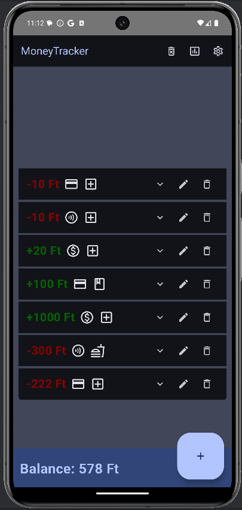
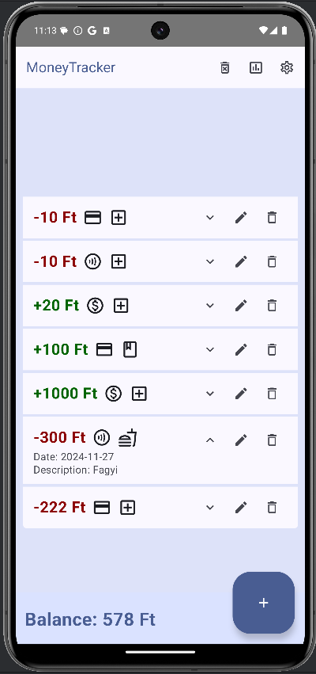

Figure 1: Budget summary list view in dark mode  
Figure 2: List view in light mode with an expanded transaction  

### Creating and Editing Transactions  
If you click the + button in the list view, you will be directed here. You can enter the amount of the new transaction in the text box, then use a toggle to specify whether it is an expense or income.  
Next, you can select the most appropriate option from the Categories and Payment Methods dropdown lists. The date picker allows you to open a calendar where you can select the transaction date.  
Finally, you can optionally add a description.  
To create the new transaction, click the button in the bottom right corner. If you change your mind and do not want to create it, you can return to the list view.  
The editor view looks the same, but instead of creating a new transaction, clicking the button updates the existing one.  

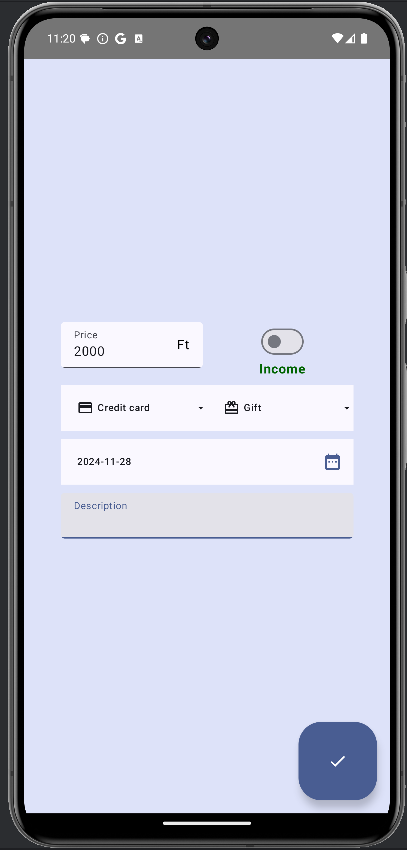
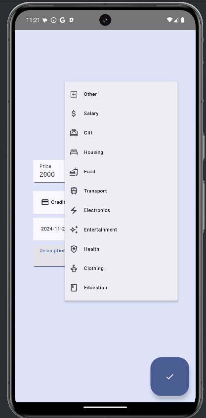

Figure 3: Creation view with amount and income selected  
Figure 4: Category dropdown list  

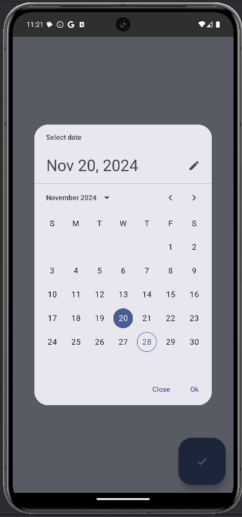
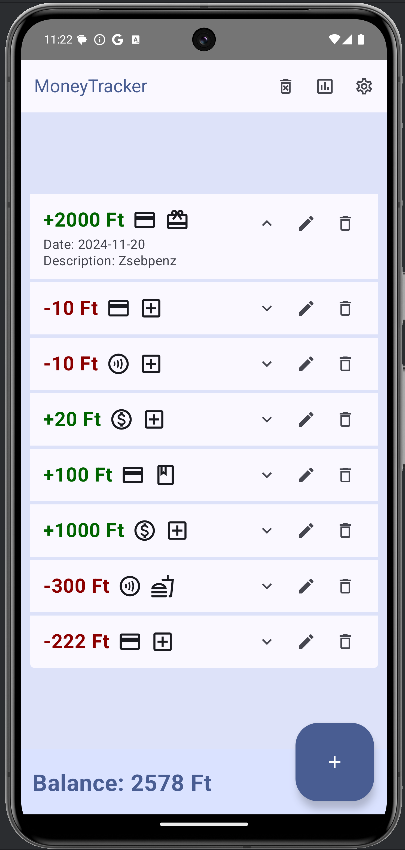

Figure 5: Date picker window  
Figure 6: After creating a transaction, it becomes visible in the summary view  

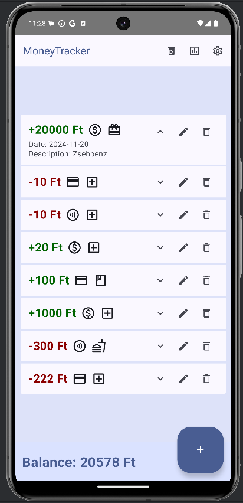

Figure 7: Editor view after clicking the edit button  
Figure 8: List after saving modifications  

### Configuring Extra Features  
If you navigated here by clicking the settings button, you will see three fields with descriptions.  
The descriptions explain the purpose of the fields: You can enter a phone number and a message segment so that your banking transactions can be automatically recorded from incoming SMS messages.  
Additionally, you can set a lower balance threshold, and if your balance falls below this level, you will receive a warning notification. The saved values can be stored by clicking the Save button. If you do not want to save them, you can return to the previous screen. If you have previously saved values, they will automatically appear in the fields, but you can modify them at any time.  
For extra features to work, the application requires permission; without it, it cannot access incoming banking SMS messages or send notifications.  
The permission request occurs when saving the data, but if you deny it and later change your mind, you can grant the necessary permissions in your phone’s settings to enable full functionality.  

Example for SMS setup:  
Phone number from which the banking SMS is received: +36303429618 should be entered in this format in the field.  
If the message is:  
MBH BANK  Card: ...8150, Event: POS purchase, Amount: 617 HUF, 2024.11.28 16:08, Balance: 2,255 HUF, OTPMOBL*JEGY.MAV.HU BUDAPEST HU  
Then the SMS postfix value should be "HUF," or "HUF" because this character sequence appears after the spent amount. As a result, the 617 HUF expense is recorded immediately.  

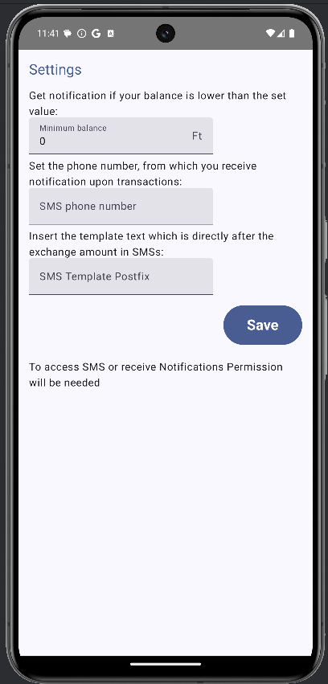
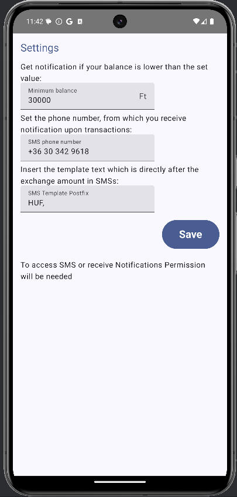

Figure 9: Default settings view  
Figure 10: Settings view after values have been saved  

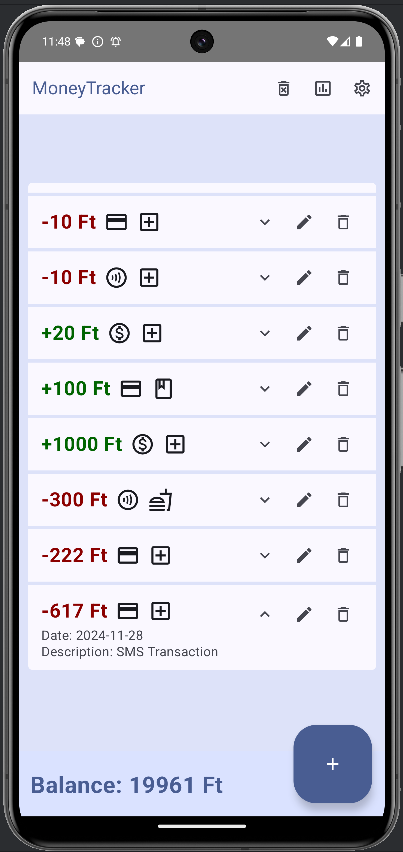
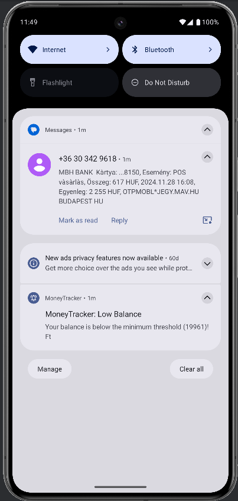

Figure 11: A transaction is recorded when a notification is received  
Figure 12: The application sends a notification if the balance drops below the minimum threshold  

### Statistics View  
On the statistics screen, transactions matching the filtering criteria are displayed in the form of charts. First, the primary filtering criterion can be selected. If nothing is selected here, no filtering options other than date selection are available, and a pie chart showing the income/expense ratio for the selected time interval will be displayed.  

If **Category** is chosen as the filter criterion, an item can be selected from the category dropdown list. Additionally, the toggle switch at the bottom of the screen allows you to choose whether to view **expenses** or **income**. The screen then displays the number of transactions associated with the selected category, grouped by **payment method**, in a pie chart, along with the total value of these transactions.  

If **Payment Method** is chosen as the filter criterion, an item can be selected from the payment methods dropdown list. The toggle switch at the bottom of the screen also allows selection between **expenses** and **income**. In this case, the screen displays transactions associated with the selected payment method, grouped by **category**, in a horizontal bar chart.  

If no chart appears, it means that no transactions match the selected filtering criteria.  

The **date selector** works similarly to the one on the creation screen, and the selected dates apply as filters to all charts. However, it's important to note that the default displayed date is **not an active filter** until dates are manually selected. (So if you don’t interact with the date selector, transactions will not be filtered by date.)  

The **navigation bar** at the top of the screen allows users to return to the **summary view** or the **settings screen**.  

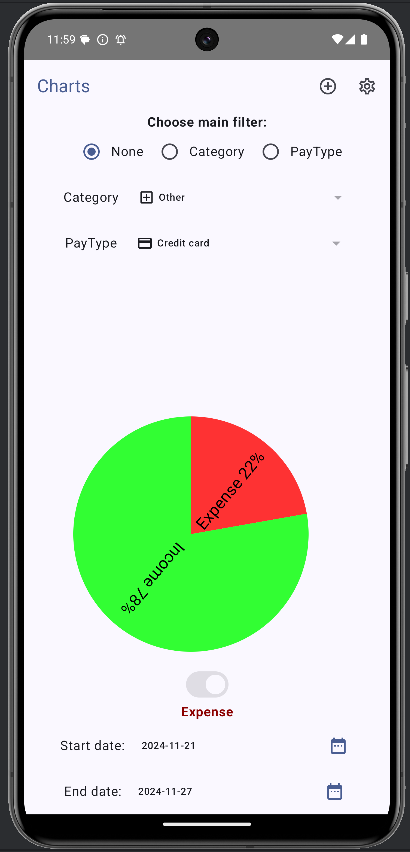
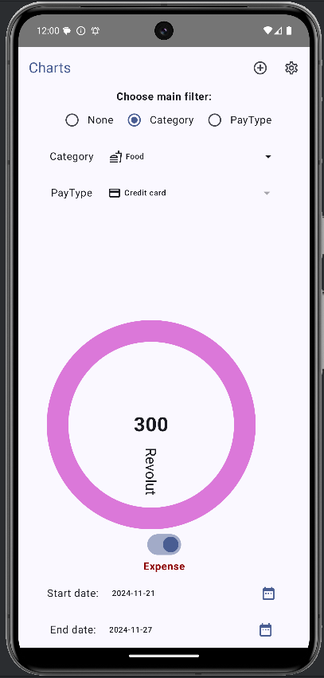

**Figure 13:** General summary of income and expense ratio in a pie chart  
**Figure 14:** Expenses for food in the past week (only 300 HUF spent via Revolut)  

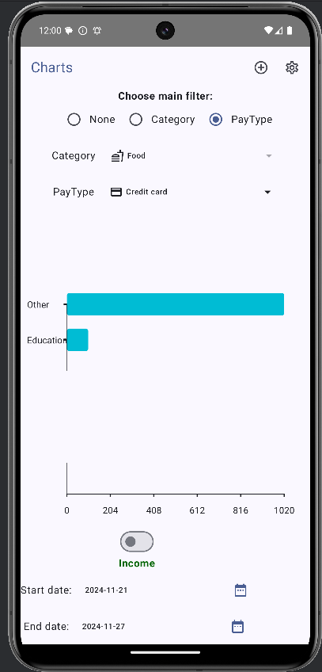
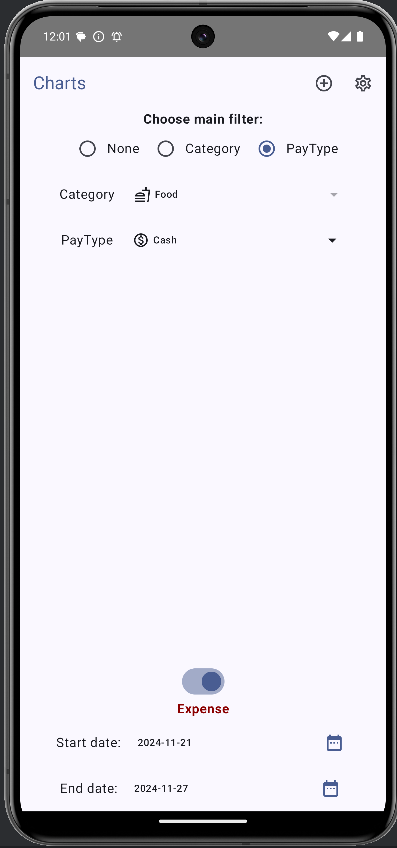

**Figure 15:** Income received via bank card, categorized in a bar chart  
**Figure 16:** If no transactions match the filtering criteria, no chart is displayed (e.g., no cash payments were made)  

---

## Technologies Used  

- All screens are **optimized for both dark and light themes**  
- [YCharts](https://github.com/yml-org/YCharts) library for rendering charts  
- **Broadcast Receiver** for processing SMS messages  
- **NotificationManager** for sending notifications  
- **SharedPreferences** for storing unstructured data  
- **SQLite-based** data storage using **Room**, with non-blocking access  
- **Hilt** for **Dependency Injection**  
- Separation of application layers using **MVVM** and **Repository Pattern**, combined with DI  

---

## Key Technical Challenges  

One of the most interesting challenges for me was independently implementing **Dependency Injection**.  

On the **main screen**, thanks to lab exercises, I had no trouble using DI—it even helped solidify my understanding. However, when I tried to apply it to an independent feature, I realized that I hadn’t fully grasped **Hilt’s** deeper workings, especially in relation to **ViewModel** and screen interactions. (DI seemed simpler in software engineering courses.)  

The **settings screen** and its **ViewModel** made me think critically. Through this, I gained a much better understanding of **Hilt**, and although I only created simple modules, injecting dependencies into the **ViewModel** helped me understand how to use it effectively.  

However, the **ViewModel** itself later became an issue—the saved values weren’t appearing on the screen. Investigating this problem led me to better understand **ViewModel, state observation, and LaunchedEffect**. (In the end, I created **two ViewModels**—one for **data storage** and another for **permission requests**, and I used **two LaunchedEffect blocks** in the Composable function.)  

Beyond this, **automated SMS processing** initially seemed complex, but I managed to implement it smoothly—aside from the **SMS encoding** issues.