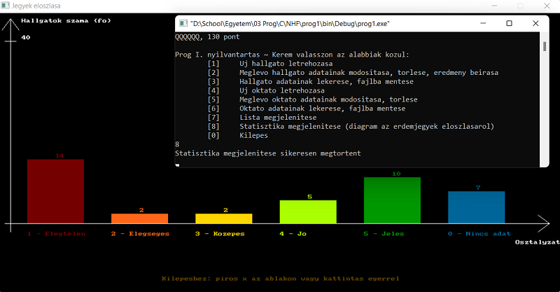

# Basics of programming 1

- Language: C
- Goal: Registry of a subject (students, exams, grades) and statistics about them.

### Read the user manual to try out the program or the developer manual to analyze it.