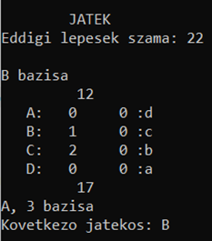

# Basics of programming 2
## Object-Oriented Programming

- Language: C++
- Goal: Making a CLI based Mancala board game with smart opponent using Minimax algorithm.

Further description in $Documentation.pdf$