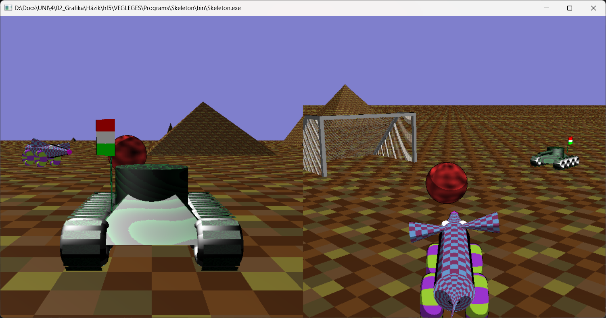
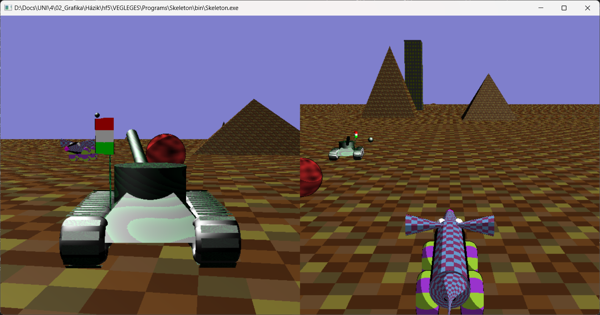
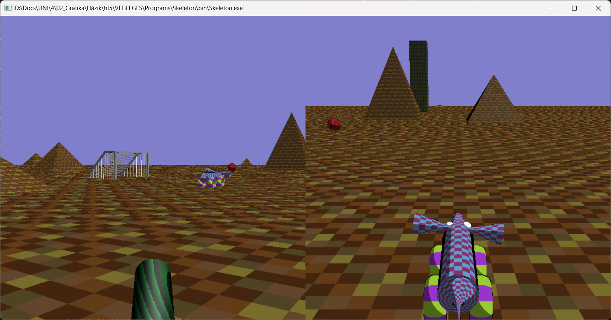
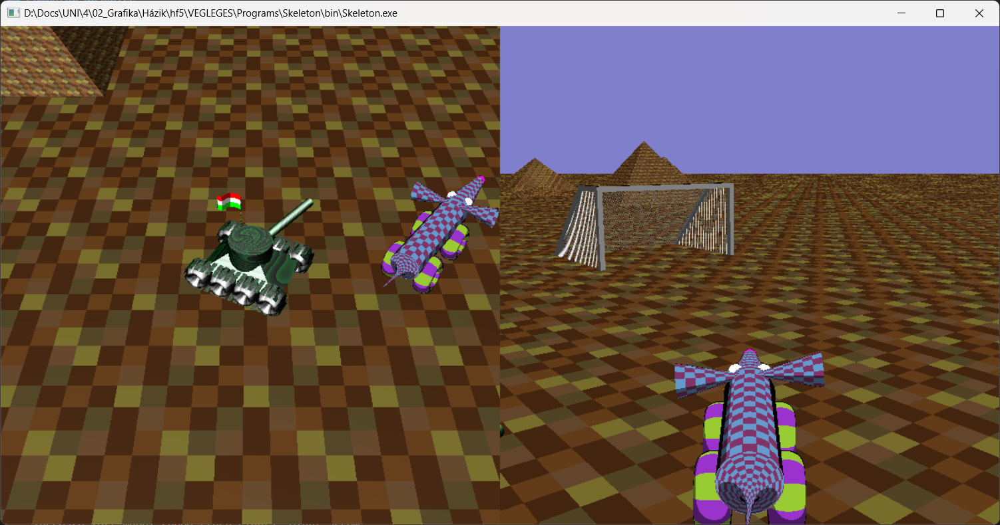
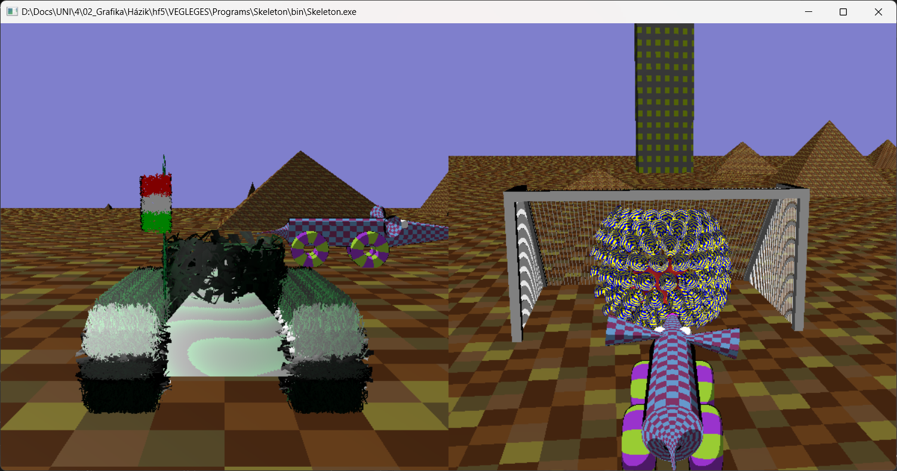

## Computer Graphics

- Language: C++, OpenGL, GLUT
- Goal: Making a videogame of a tank and a mouse with the use of ray-tracing, collision detection, virtual camera usage, etc.
- For running the program the installation of freeglut and glew-1.13.0 is needed

## The tank must aim to shoot the mouse to win.
  - Accelerate left tracks: A
  - Decelerate left tracks: a
  - Accelerate right tracks: D
  - Decelerate right tracks: d
  - Raise turret: W or w
  - Lower turret: S or s
  - Rotate turret left: Q or q
  - Rotate turret right: E or e
  - Stabilize turret: Y or y
  - Destabilize turret: X or x
  - Increase shooting power: 3
  - Decrease shooting power: 1
  - Switch view (RPS, FPS, Drone, Bird's-eye): c
  - Stop camera: C

### Shooting

## Moving the camera in Drone view:
  - Move left: 4
  - Move right: 6
  - Move forward: 8
  - Move backward: 2
  - Move up: 5
  - Move down: 0
  - Rotate left: 7
  - Rotate right: 9
  - Look up: +
  - Look down: -
  - Respawn on tank: ,

### FPS view

### Drone view

## The mouse must move and hit the ball and score a goal.
  - Increase forward speed: Up arrow
  - Decrease speed or increase backward speed: Down arrow
  - Increase right wheel speed (turn left): Left arrow
  - Increase left wheel speed (turn right): Right arrow

### Scoring

