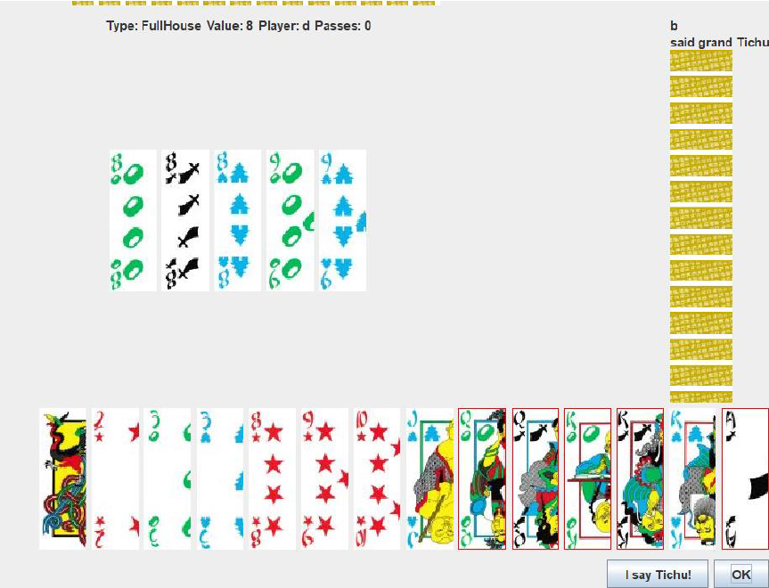

# Basics of programming 3
## Object-Oriented Programming

- Language: Java
- Goal: Making a Tichu card game with user interface.

Further description about the game in $Documentation.pdf$
Developer documentation made with Javadoc as comments