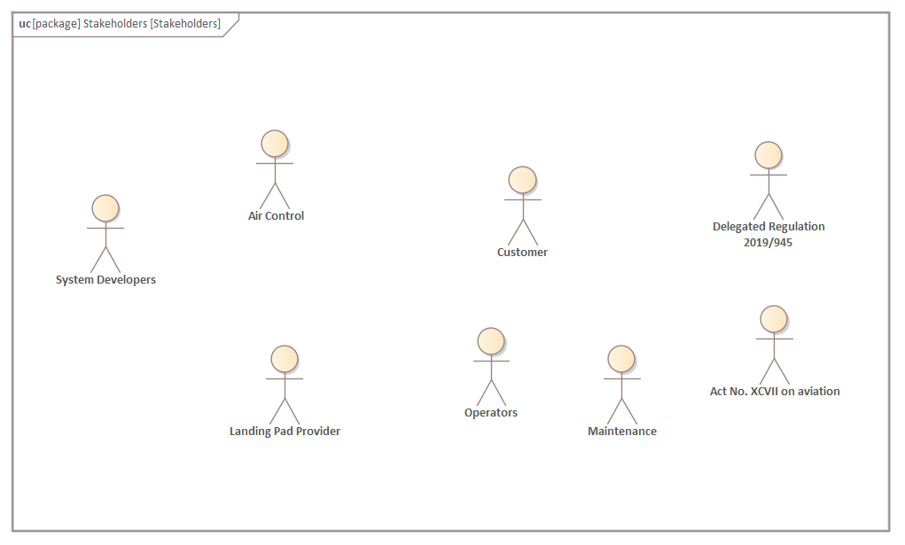
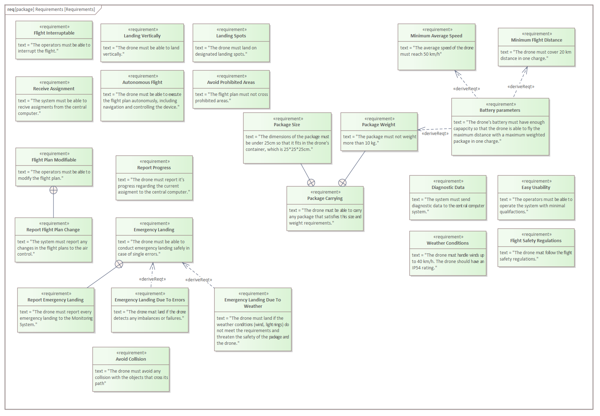
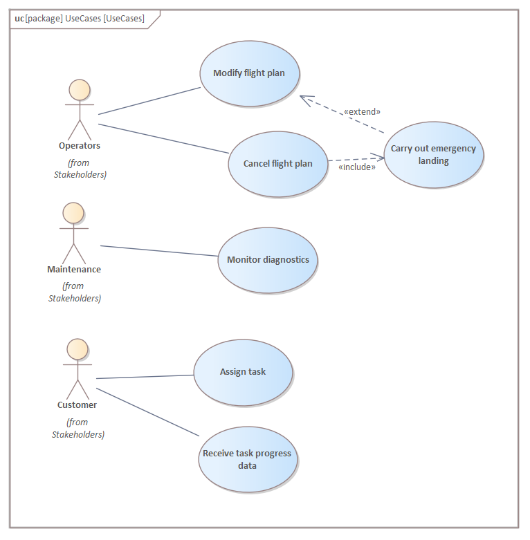
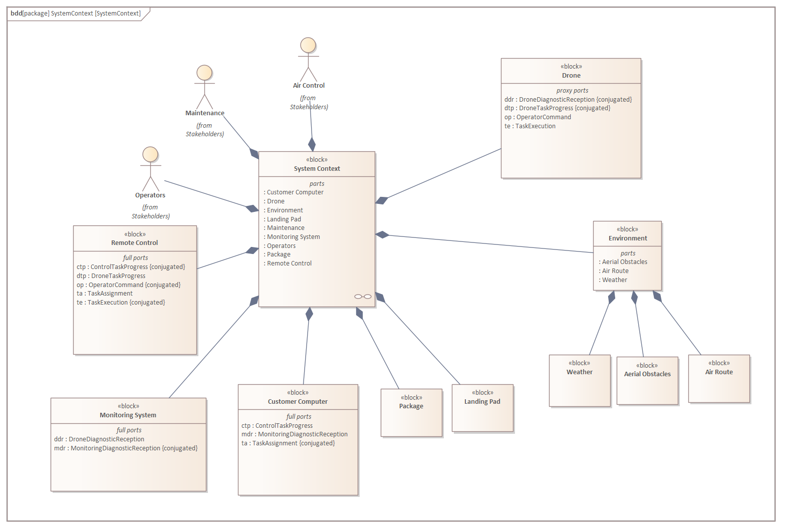
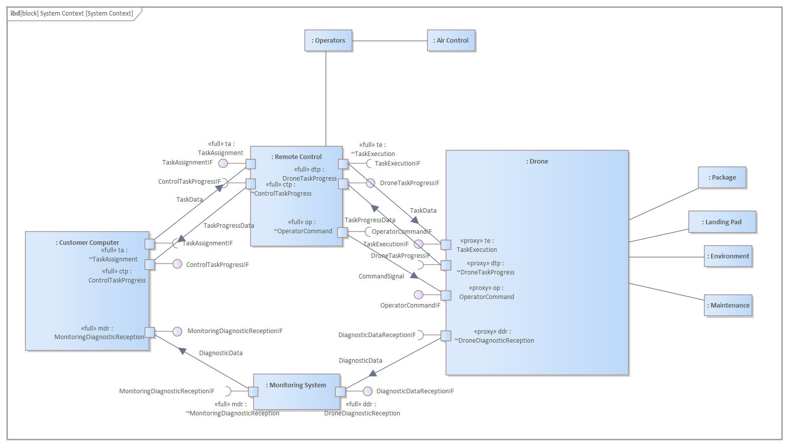
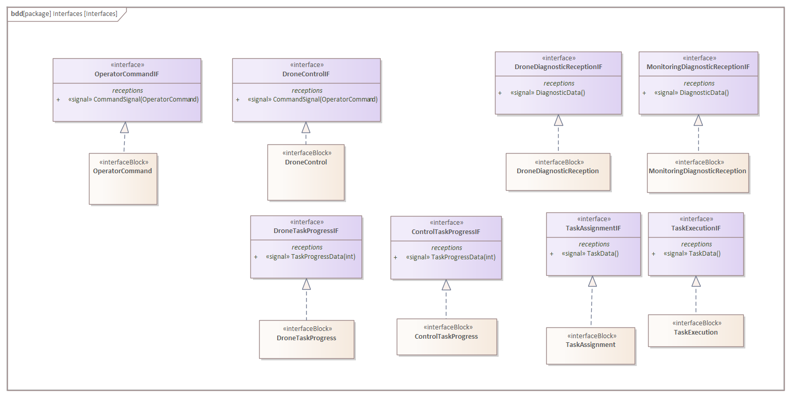
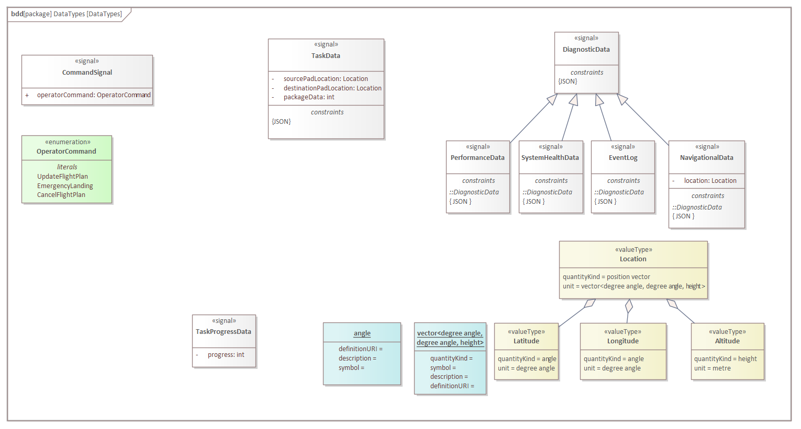

# Assignment 1

## Stakeholders (UC)

 - **Customer:** Orders the product and uses it for delivery by sending task assignments.
 - **Landing Pad Provider:** Provides Landing Pads for picking-up and delivering packages. Also responsible for charging drones.
 - **Operators:** Operators can override the flight of the drone in special cases.
 - **Maintenance:** Receives diagnostic data and repairs drones if necessary.
 - **Air Control:** Monitors the path of the routes and other flying objects. It can command the operators to change the routing plan. Air control also tracks the drone's location via it's satellite system.
 - **Legislation**: UAVs are regulated by the Delegated Regulation 2019/945 and the Act No. XCVII on aviation in Hungary.

## Requirements (REQ)

We have identified several functional and extra-functional requirements from a couple of stakeholders.

### Functional requirements

Most of the expectations towards the system came from the customer. We broke them down and it resulted in the following requirements:
- **F01 Autonomous Flight**: The drone must be able to execute the flight plan autonomously (including navigation and controlling the device), even in case of a data-connection error.
- **F02 Receive Assignment**: The system must be able to receive assignments from the central computer.
- **F03 Report Progress**: The drone must report its progress regarding the current assignment to the central computer.
- **F04 Landing Vertically**: The drone must be able to land vertically.
- **F05 Flight Interruptable**: The operators must be able to interrupt the flight.
- **F06 Flight Plan Modifiable**: The operators must be able to modify the flight plan.
- **F07 Report Flight Plan Change**: The system must report any changes in the flight plans to the air control.
- **F10 Follow Flight Plan**: The drone must remain in the $10 m$ vicinity of the pre-declared flight plan. 
- **F11 Maximum Flight Height**: The drone must not fly higher than $200 m$.

There were also some expectations coming from the Air Control, which resulted in the following requirements:
- **F08 Landing Spots**: The drone must land on designated landing spots.
- **F09 Avoid Prohibited Areas**: The flight plan must not cross prohibited areas.

### Extra-functional requirements

Expectations from the costumer and Air Control both resulted in extra-functional requirements and we as designers of the system also added some. We further classified the extra-functional requirements to these categories:

#### Usability

- **U01 Easy Usability**: The operators must be able to operate the system with a training lasting maximum $1$ day.
- **U02 Package Size**: The size of the package must be under $250~mm \cdot 150~mm \cdot 140~mm$.
- **U03 Package Weight**: The package must not weight more than $3~kg$.
- **U04 Package Carrying**: The drone must be able to carry any package that satisfies this size and weight requirements.
- **U05 Drone size**: The drone must fit in $2$-meter-diameter circle and must not be taller than $1~m$.
- **U06 Drone weight**: The drone (package included) must not be heavier than $20~kg$.

#### Reliability

- **R01 Weather Conditions**: The drone must handle winds up to $40~km/h$. The drone should have an IP54 rating. We added this requirement, but we didn't find any specifications regarding the weather conditions in which the drone should be operable, so we went with our estimation.
- **R02 Emergency Landing**: The drone must be able to conduct emergency landing safely in case of single errors.
- **R03 Emergency Landing Due To Errors**: The drone must land if the drone detects any imbalances or failures.
- **R04 Emergency Landing Due To Weather**: The drone must land if the weather conditions (wind, lightnings) do not meet the requirements and threaten the safety of the package and the drone.
- **R05 Report Emergency Landing**: The drone must report every emergency landing to the Monitoring System.
- **R06 Finish Delivery in Rain**: The drone must finish the current delivery even if it rains.
- **R07 Restart Time**: The onboard system must be able to restart in $3$ seconds.

#### Performance

- **P01 Minimum Average Speed**: The drone must be able to reach $50~km/h$ avarage speed. In the specification we only found that the round-trip time should be low as possible, so we went with our estimation.
- **P02 Minimum Flight Distance**: The drone must be able to cover $25~km$ distance in one charge. We added this requirement, but we didn't find any specifications regarding the minimum flight distance, so we went with our estimation.
- **P03 Battery parameters**: The drone's battery must have enough capacity so that the drone is able to fly the maximum distance with a maximum weighted package in one charge.
- **P04 Maximum Speed**: The drone must not go over the speed of sound.
- **P05 Maximum Down-Time**: The drone must not spend more than $20$ minutes with preparations between deliveries if there is a new task available.

#### Safety

- **SA01 Flight Safety Regulations**: The drone must follow the flight safety regulations.
- **SA02 Avoid Collision**: The drone must avoid any collision with the objects that cross its path.
- **SA03 Operators Take Control**: The operators must be able to take control of the drones.

#### Maintainability

- **M01 Diagnostic Data**: The system must send diagnostic data to the central computer system.
- **M02 Diagnostic Data Flow Rate**: The system must send diagnostic data with a minimum frequency of $1~Hz$.

#### Security
- **SE01 Communication Encrypted**: The communication with the drone should be secured by an accepted encryption protocol.

### Connections between the requirements

The **Report Flight Plan Change** further specifies what should happen when the flight plan is modified, so it's contained by **Flight Plan Modifiable**.

Similarly **Report Emergency Landing** further specifies a part of the emergency landing process so it's contained by **Emergency Landing**.

There are also connections between **Emergency Landing Due To Errors**, **Emergency Landing Due To Weather** and **Emergency Landing**, because they define when an emergency landing should be conducted.

**Package Carrying** contains **Package Size** and **Package Weight**, because they are used in it.

**Battery parameters** is connected to **Minimum Average Speed**, **Minimum Flight Distance** and **Package Weight**, because they are all influencing the required battery.

## Use cases (UC)

- Operators have two roles. They are able to modify flight plans that always overrides the current one. In some emergency cases like weather change, modifying means temporarily staying at a landing pad and then continue its delivery. Operators can also cancel the flight plan, which must include a path to a landing pad. Air Control can only override the flight through operators.
- Maintenance monitors diagnostics. (We didn't take repairing as a use-case.)
- Customer can assign new task, extending the delivery plan. They also receive progress information from the drone.

The former use case of the customer (assigning a new task for the drone) is further elaborated below. The task assignment is sent as TaskData that is described in the corresponding section. For the process, the customer's computer uses the Remote Control system.

## System context (BDD)

- **Remote Control:** Operators and the customer can communicate with the drones and the drone sends progress information to the customer via this component. This component belongs to our company. 
- **Monitoring System:** Proxy server between the customer and the drone for the customer to receive diagnostic data.
Both the monitoring system and remote control aim to provide an easily usable interface while ensuring sensitive information security as well.
- **Customer Computer:** The customer's system that communicates with the remote control and monitoring system. Represents the customer.
- **Package:** The package that the drone delivers. Has to fit in the drone's container.
- **Landing Pad:** The drone delivers packages between landing pads, also charging its battery on them. Loading and unloading is carried out automatically, provided by outer company.
- **Environment:** Consists of Weather, Aerial Obstacles and Air Route. The drone must take into consideration these circumstances while planning and completing tasks.
- **Drone:** Represents the drone's whole system.
- Operators, Maintanance and Air Control represent the stakeholders that communicate with our system.

## System context (IBD)

The Drone communicates with the Customer Computer via the Monitoring System and the Remote Control.

The Drone receives the task/delivery via its TaskExecution port. The Drone has DroneTaskProgress port which is used for sending progress data to the Remote Control. The Drone has an OperatorCommand port that is used to receive commands from the Remote Control. These commands are sent by the operators. The Drone also has DroneDiagnosticReception port for sending diagnostic data to the Monitoring System. The Drone has 4 interfaces for each of its ports. The Remote Control and Monitoring System have the corresponding ports for the communication.

The Customer Computer has the following ports: TaskAssignment, ControlTaskProgress and MonitoringDiagnosticReception. These are important for receiving and sending the information discussed earlier.
These ports communicate through different interfaces with the Monitoring System and the Remote Control than the Drone does, allowing unified and secured communication with the Drone. The Remote Control and Monitoring System have the corresponding ports for the communication.

The Drone receives data about the Environment including the weather conditions and observes its surroundings through sensors.
The Maintenance has contact with the Drone due to repairing.
The Drone has contact with the Package during delivery. Package is picked up into the Drone's Container.
The Drone communicates with the Landing Pad during picking up or delivering a package, or charging.

Air Control can modify the drone's route through Operators. Operators are able to control the Drone's behaviour using the Remote Control.

## Data types (BDD)

- **CommandSignal:** This signal is used by Remote Control to send OperatorCommand to the Drone.
- **OperatorCommand:** enumeration representing the commands that the Operation can send. The command options are: updating flight plan (UpdateFlightPlan), conduct emergency landing (EmergencyLanding), cancel flight plan (CancelFlightPlan).
- **TaskData:** This signal consists of sourcePadLocation, destinationPadLocation and packageData which represent the task description sent by the customer in JSON format.
- **DiagnosticData:** This signal consists of PerformanceData, SystemHealthData, EventLog and NavigationData which represent the diagnostics of the Drone sent to the Monitoring System in JSON format.
- **TaskProgressData:** This signal represents the actual task's progress data. It contains an integer that represents the percentage of the delivery.
- **Location:** This value type represents the location of the given object (Drone, Landing Pad, etc.) in three dimensions with a vector of the followings: Latitude and Longitude are provided in degree angle, while Altitude means the height of the object above the sea level in metres.
