# Assignment 2

## Stakeholders (UC)
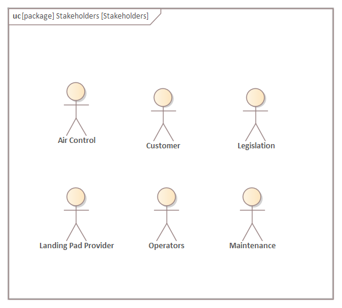

 - **Customer:** Orders the product and uses it for delivery by sending task assignments.
 - **Landing Pad Provider:** Provides Landing Pads for picking-up and delivering packages. Also responsible for charging drones.
 - **Operators:** Operators can override the flight of the drone in special cases.
 - **Maintenance:** Receives diagnostic data and repairs drones if necessary.
 - **Air Control:** Monitors the path of the routes and other flying objects. It can command the operators to change the routing plan. Air control also tracks the drone's location via it's satellite system.
 - **Legislation**: UAVs are regulated by the Delegated Regulation 2019/945 and the Act No. XCVII on aviation in Hungary.

## Requirements (REQ)
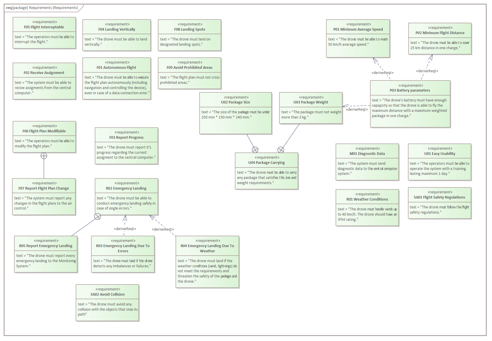

We have identified several functional and extra-functional requirements from a couple of stakeholders.

### Functional requirements

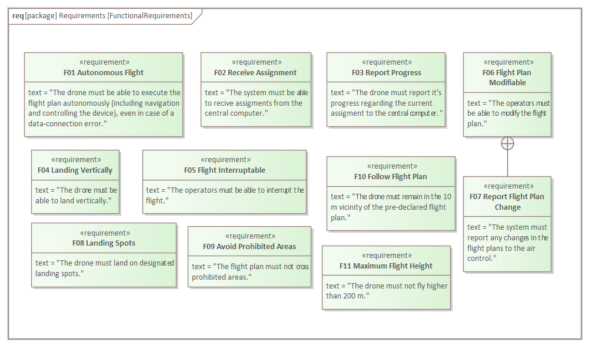

Most of the expectations towards the system came from the customer. We broke them down and it resulted in the following requirements:
- **F01 Autonomous Flight**: The drone must be able to execute the flight plan autonomously (including navigation and controlling the device), even in case of a data-connection error.
- **F02 Receive Assignment**: The system must be able to receive assignments from the central computer.
- **F03 Report Progress**: The drone must report its progress regarding the current assignment to the central computer.
- **F04 Landing Vertically**: The drone must be able to land vertically.
- **F05 Flight Interruptable**: The operators must be able to interrupt the flight.
- **F06 Flight Plan Modifiable**: The operators must be able to modify the flight plan.
- **F07 Report Flight Plan Change**: The system must report any changes in the flight plans to the air control.
- **F10 Follow Flight Plan**: The drone must remain in the $10 m$ vicinity of the pre-declared flight plan. 
- **F11 Maximum Flight Height**: The drone must not fly higher than $200 m$.

There were also some expectations coming from the Air Control, which resulted in the following requirements:
- **F08 Landing Spots**: The drone must land on designated landing spots.
- **F09 Avoid Prohibited Areas**: The flight plan must not cross prohibited areas.

### Extra-functional requirements

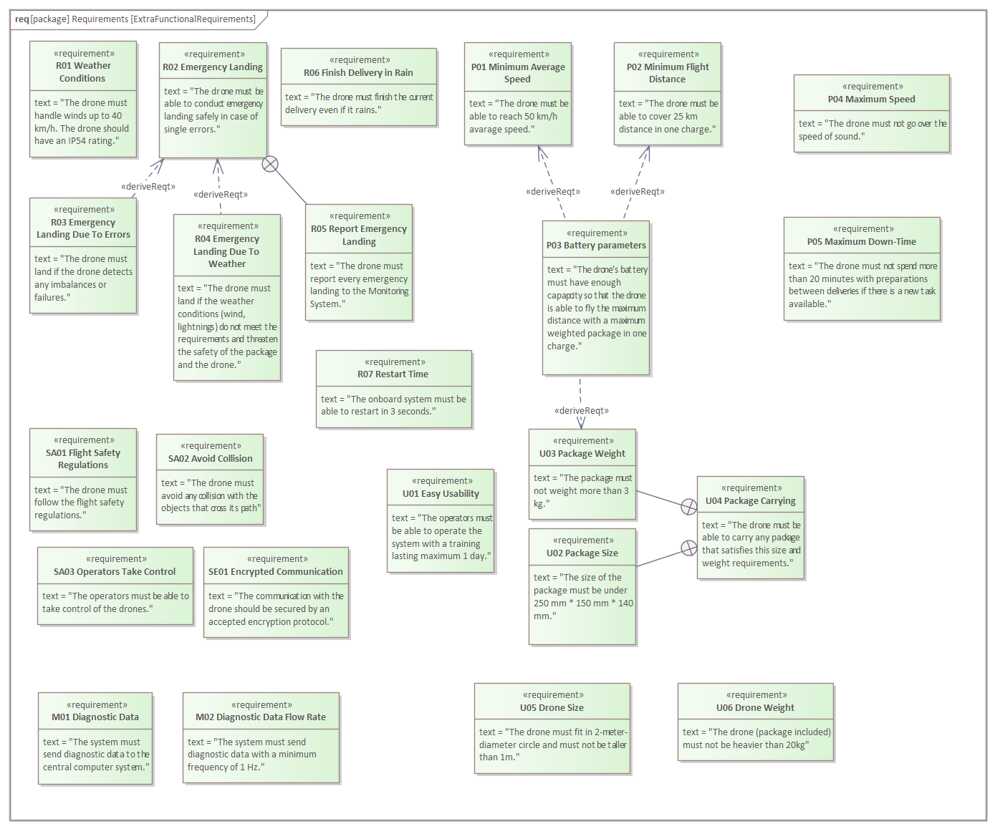

Expectations from the costumer and Air Control both resulted in extra-functional requirements and we as designers of the system also added some. We further classified the extra-functional requirements to these categories:

#### Usability

- **U01 Easy Usability**: The operators must be able to operate the system with a training lasting maximum $1$ day.
- **U02 Package Size**: The size of the package must be under $250~mm \cdot 150~mm \cdot 140~mm$.
- **U03 Package Weight**: The package must not weight more than $3~kg$.
- **U04 Package Carrying**: The drone must be able to carry any package that satisfies this size and weight requirements.
- **U05 Drone size**: The drone must fit in $2$-meter-diameter circle and must not be taller than $1~m$.
- **U06 Drone weight**: The drone (package included) must not be heavier than $20~kg$.

#### Reliability

- **R01 Weather Conditions**: The drone must handle winds up to $40~km/h$. The drone should have an IP54 rating. We added this requirement, but we didn't find any specifications regarding the weather conditions in which the drone should be operable, so we went with our estimation.
- **R02 Emergency Landing**: The drone must be able to conduct emergency landing safely in case of single errors.
- **R03 Emergency Landing Due To Errors**: The drone must land if the drone detects any imbalances or failures.
- **R04 Emergency Landing Due To Weather**: The drone must land if the weather conditions (wind, lightnings) do not meet the requirements and threaten the safety of the package and the drone.
- **R05 Report Emergency Landing**: The drone must report every emergency landing to the Monitoring System.
- **R06 Finish Delivery in Rain**: The drone must finish the current delivery even if it rains.
- **R07 Restart Time**: The onboard system must be able to restart in $3$ seconds.

#### Performance

- **P01 Minimum Average Speed**: The drone must be able to reach $50~km/h$ avarage speed. In the specification we only found that the round-trip time should be low as possible, so we went with our estimation.
- **P02 Minimum Flight Distance**: The drone must be able to cover $25~km$ distance in one charge. We added this requirement, but we didn't find any specifications regarding the minimum flight distance, so we went with our estimation.
- **P03 Battery parameters**: The drone's battery must have enough capacity so that the drone is able to fly the maximum distance with a maximum weighted package in one charge.
- **P04 Maximum Speed**: The drone must not go over the speed of sound.
- **P05 Maximum Down-Time**: The drone must not spend more than $20$ minutes with preparations between deliveries if there is a new task available.

#### Safety

- **SA01 Flight Safety Regulations**: The drone must follow the flight safety regulations.
- **SA02 Avoid Collision**: The drone must avoid any collision with the objects that cross its path.
- **SA03 Operators Take Control**: The operators must be able to take control of the drones.

#### Maintainability

- **M01 Diagnostic Data**: The system must send diagnostic data to the central computer system.
- **M02 Diagnostic Data Flow Rate**: The system must send diagnostic data with a minimum frequency of $1~Hz$.

#### Security
- **SE01 Communication Encrypted**: The communication with the drone should be secured by an accepted encryption protocol.

### Connections between the requirements

The **Report Flight Plan Change** further specifies what should happen when the flight plan is modified, so it's contained by **Flight Plan Modifiable**.

Similarly **Report Emergency Landing** further specifies a part of the emergency landing process so it's contained by **Emergency Landing**.

There are also connections between **Emergency Landing Due To Errors**, **Emergency Landing Due To Weather** and **Emergency Landing**, because they define when an emergency landing should be conducted.

**Package Carrying** contains **Package Size** and **Package Weight**, because they are used in it.

**Battery parameters** is connected to **Minimum Average Speed**, **Minimum Flight Distance** and **Package Weight**, because they are all influencing the required battery.

## Use cases (UC)
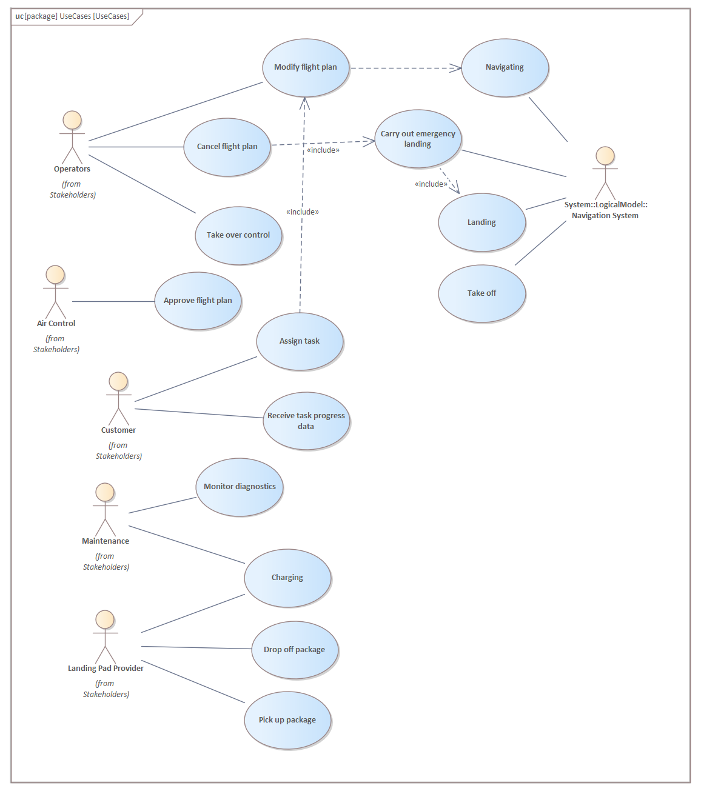

- Operators have three roles. 
  - They are able to modify flight plans that always overrides the current one. In some emergency cases like weather change, modifying means temporarily staying at a landing pad and then continue its delivery. 
  - Operators can also cancel the flight plan, which must include a path to a landing pad. Air Control can only override the flight through operators.
  - Operators can also take over the control of the drone if necessary (as required by some reqiurements)
- The air control team can approve or deny flight plans created by the drone's navigation system. The corresponding use cases defines both.
- The customer can assign a task that always means a modification in the flight plan (a new flight plan is created). They also receive the task progress in percentage.
- Maintenance monitors diagnostics. They are also able to charge the drones. (We didn't take repairing as a use-case.)
- The landing pad providers (more specifically their docking stations) can load packages into the drone's container. They can also removed them and charge the drones.

The former use case of the customer (assigning a new task for the drone) is further elaborated below. The task assignment is sent as TaskData that is described in the corresponding section. For the process, the customer's computer uses the Remote Control system.

## System context (BDD)
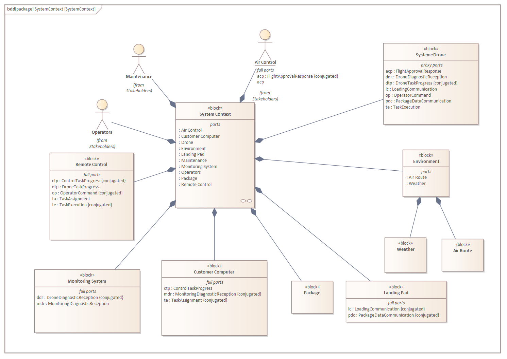

- **Remote Control:** Operators and the customer can communicate with the drones and the drone sends progress information to the customer via this component. This component belongs to our company. 
- **Monitoring System:** Proxy server between the customer and the drone for the customer to receive diagnostic data.
Both the monitoring system and remote control aim to provide an easily usable interface while ensuring sensitive information security as well.
- **Customer Computer:** The customer's system that communicates with the remote control and monitoring system. Represents the customer.
- **Package:** The package that the drone delivers. Has to fit in the drone's container.
- **Landing Pad:** The drone delivers packages between landing pads, also charging its battery on them. Loading and unloading is carried out automatically, provided by outer company.
- **Environment:** Consists of Weather (e.g. wind and ice conditions) and the Air Route. The drone must take into consideration these circumstances while planning and completing tasks.
- **Drone:** Represents the drone's whole system.
- Operators, Maintanance and Air Control represent the stakeholders that communicate with our system.

## System context (IBD)

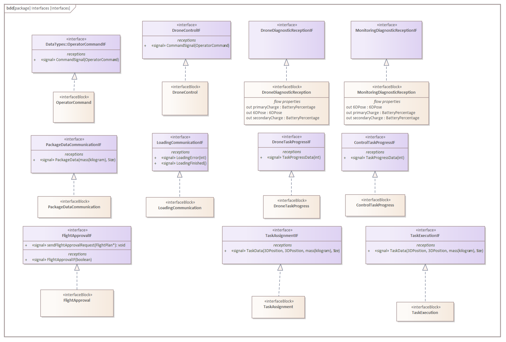

The Drone communicates with the Customer Computer via the Monitoring System and the Remote Control.

The Drone receives the task/delivery via its TaskExecution port. The Drone has DroneTaskProgress port which is used for sending progress data to the Remote Control. The Drone has an OperatorCommand port that is used to receive commands from the Remote Control. These commands are sent by the operators. The Drone also has DroneDiagnosticReception port for sending diagnostic data (continuously, with a frequency of at least 1 Hz) to the Monitoring System. This communication is represented as a data flow, because data is flowing frequently, and continuously.
The Drone has 7 interfaces for each of its ports. The Remote Control and Monitoring System have the corresponding ports for the communication.

The Customer Computer has the following ports: TaskAssignment, ControlTaskProgress and MonitoringDiagnosticReception. These are important for receiving and sending the information discussed earlier.
These ports communicate through different interfaces with the Monitoring System and the Remote Control than the Drone does, allowing unified and secured communication with the Drone. The Remote Control and Monitoring System have the corresponding ports for the communication.

The Drone receives data about the Environment including the weather conditions and observes its surroundings through sensors.

The Maintenance has continuous contact with the Drone due to repairing.

The drone has contact with the package during delivery. The package is loaded into the drone's container. The docking station (landing pad) sends a finished signal and error signals (in case of error) to the drone's system. It also sends data about the package. This communication with the Landing Pad is during picking up or delivering a package, or charging.

Air Control can modify the drone's route through Operators. Operators are able to control the Drone's behaviour using the Remote Control. The air control team can also send flight plan approvals to the drone so that it can start it route.

## Data types of the system context (BDD)
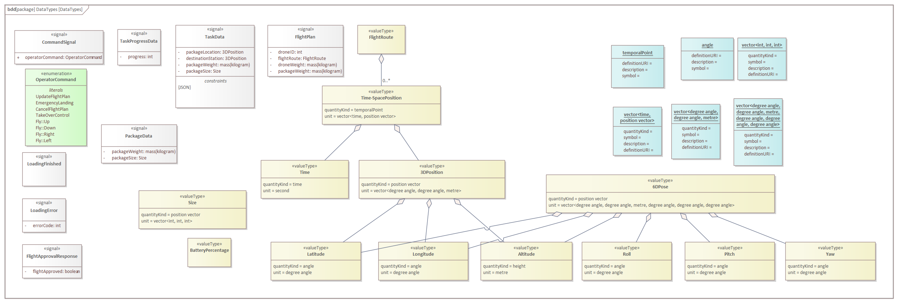

- **CommandSignal:** This signal is used by Remote Control to send OperatorCommand to the Drone.
- **OperatorCommand:** enumeration representing the commands that the Operation can send. The command options are: updating flight plan (UpdateFlightPlan), conduct emergency landing (EmergencyLanding), cancel flight plan (CancelFlightPlan). These commands are also used by the operators to take the control over the drone (TakeOverControl) and control its movements afterwards (Fly::Up, Fly::Down, Fly::Right, Fly::Down). 
- **TaskData:** This signal consists of the source pad's location (the pad where the package is initially stored), the destination pad's location (where the package needs to be delivered) and the weight and size of the package to be delivered. The task description is sent by the customer in JSON format.
- **TaskProgressData:** This signal represents the actual task's progress data. It contains an integer that represents the percentage of the delivery.
- **FlightPlan:** This signal represents the flight plan created by the drone's navigation system. It contains the drone's ID, the created route itself and the basic data of the package that is to be delivered.
- **PackageData:** This signal is for sending basic data about the package. This is used by the lading pad (docking station).
- **LoadingFinished and LoadingError:** These are signal used by the lading pad to indicate the end of loading process and the errors occured during the process.
- **FlightApprovalResponse:** This signal is sent when communicating between the drone and the air control directly. The request's result (true/false) is returned.  
- **3DPosition:** This value type represents the location of the given object (Drone, Landing Pad, etc.) in three dimensions with a vector of the followings: Latitude and Longitude are provided in degree angle, while Altitude means the height of the object above the sea level in metres.
- **6DPose:** This is a vector value that contains location coordinates as well as rotation values (roll, pitch, yaw) as indicated on the figure above. The rotation values are angle values in degrees.
- **FlightRoute:** This value type represents the flight route itself. It consists of some temporal points (Time-SpacePosition) that describe a timestamp (Time) and a location (3DPosition).
- **Size:** This value type describes the size of the package as a 3D vector. The x,y and z components of the vector are the width, height, and depth of the package in millimetres.
- The other boxes represent quantity kinds that are used for temporal points and for angles. There are custom units for vectors decribed above.

## Logical/Functional system (BDD)

- **Diagnostic System:** This component is responsible for processing telemetry data sources (sensor data, etc.) and send them to the communication module.
- **Engine Control System:** This component controls the engine by receiving commands and power it.
- **Package Handling System:** This is the subsystem of the drone that receives the package data from the landing pad (docking station) and processes them.
- **Task Execution System:** This component is responsible for receiving the description of task assignment and forward it to the navigation system. This component is also responsible for checking if the task has the correct format and contains valid data.   
- **Power Management System:** This component handles the primary and secondary batteries. It continuously monitors their health and if the primary breaks down or if it drains, this system automatically switches the power source. It also provides the telemetry data related to the batteries.
- **Communication System:** This component provides communication between the internal subsystems of the drone and the other devices. It is able to process wireless signals and forward them to the corresponding internal components.
- **Navigation System:** This is a complex subsystem that provides several functions.
  - **Location System:** This subsystem is responsible for providing location data of the drone continuously.
  - **Sensor Management System:** This subsystem handles the sensors (gyroscope, IR sensor, etc.). It also provides diagnostic data related to the sensors it handles.
  - **Route Management System:** This subsystem creates and the flight plan and executes it (controls the engine) while sending data about the task's progress. It is also responsible for executing only approved flight plans.

## Logical/Functional system (IBD)

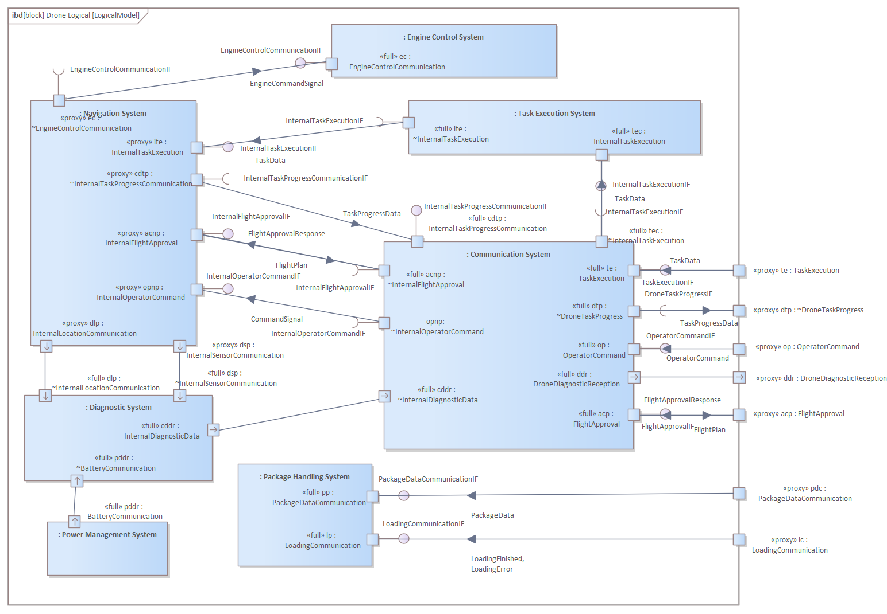

### Package Handling System

The **Package Handling System** component receives signals from the pick up station while the drone waits for the package to be hauled into its container. It has two ports. Via the **PackageDataCommunication** port it receives data about the package. Through the **LoadingCommunication** port it receives information about the states of the loading procedure.

### Diagnostic System

It receives data from the **Navigation System** via its **InternalSensorCommunication** and **InternalLocationCommunication** ports. It also receives data about the battery level from the **Power Management System** via its **BatteryCommunication** port. The subsystem bundles these datas together and sends it to **Communication System** through the **InternalDiagnosticData** port.

### Task Execution System

This subsystem receives **TaskData** from the **Comunication System** via its **InternalTaskExecution** port and forwards it to the **Navigation System** to begin the planning of the flight.

### Communication System

This subsystem connects the other components with the outer world. It receives **TaskData** through its **TaskExecution** port and forwards it to its **InternalTaskExecution** port. Similarly **OperatorCommands** arriving on the **OperatorCommand** port are forwarded to the **InternalOperatorCommand** port. Through the **FlightApproval** port the drone is able to communicate with the **Air Control**. The subsystem can receive **FlightPlan** on its **InternalFlightApproval** port and forwards it to its **FlightApproval** port. On the same port it can also receive **FlightApprovalResponse** from the **Air Control** and it forwards this signal to its **InternalFlightApproval** port. From the **Navigation System** it can reveive **TaskProgressData** via its **InternalTakProgressCommunication** port and forwards it to its **DroneTaskProgress** port. Finally, it receives diagnostic data from the **Diagnostic System** through its **InternalDiagnosticData** and forwards it to its **DroneDiagnosticReception** port.

## Navigation system (IBD)

The Navigation System has 3 components/subsystems.

### Route Management System

It receives information about a task via the **InternalTaskExecution** port. It provides connection with the **Task Execution System**.  It is basically used to start the planning of a flight. The **InternalOperatorCommand** port is another port from which the system can be commanded. Operators can modify or cancel a flight via this port. 

The subsystem sends the progress data out via its **TaskProgressCommunication** port. With this the outside world is able to receive information about the task that is being carried out. It also communicates with the **Engine Control System** via its **EngineControlCommunication** port and sends signals to it to control the movement of the drone.

The subsystem recevies data from the other 2 components of the **Navigation System**. It receives data from the **Location System** through the **InternalLocationCommunication** port. It receives data from the **Sensor Management System** via the **InternalSensorCommunication** port. The subsystem uses these datas during the planning and executing of a flight route.
The sensors' dataflow is continuous.

This subsystem is also in connection with the **Air Control** via the **InternalFlightApproval** port. It provides full-duplex connection, the subsystem sends out the proposed **FlightPlan** and receives a response from the **Air Control** in form of a **FlightApprovalResponse** signal.

### Location System

This subsystem manages the location data of the drone. It has only one port, the **InternalLocatorCommunication**. Via this port it sends out location data to the **Route Management System** as well as to the outer **Diagnostic System** component.

### Sensor Management System

This subsystem manages the sensor data of the drone. It has only one port, the **InternalSensorCommunication**. Via this port it sends out sensor data to the **Route Management System** as well as to the outer **Diagnostic System** component.

## Interfaces of the logical/functional sytem (BDD)

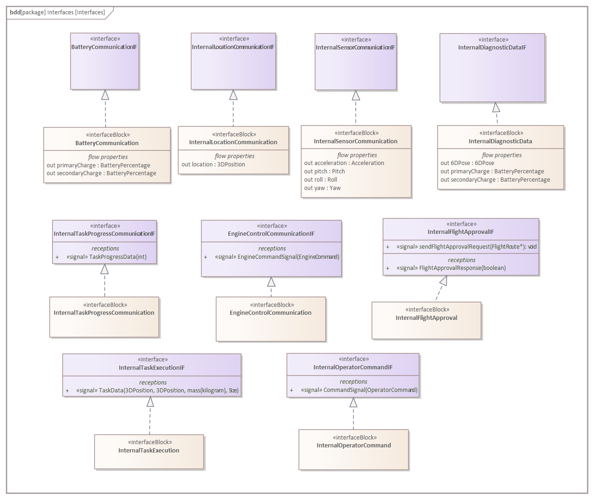 

The diagram above shows the interfaces used by the components in the functional decomposition.
There are 2 types of interfaces:

### Interfaces sending out data

The following interfaces are implemented by components that produce and send out data to other components. The data production is usually continuous so it's modelled by flows.

- **BatteryCommunication:** The battery management module sends out 2 types of data: a primary and a secondary charge percentage.
- **InternalLocationCommunication:** In the navigation subsystem the location module can send location data.
- **InternalSensorCommunication:** Similarly to the location the sensor management can send data containing 4 metrics: acceleration, pith, roll and yaw.
- **InternalDiagnosticData:** The diagnostic module can send 3 types of data: 6D positions, primary and secondary battery percentages.

### Interfaces receiving signals 

The following interfaces are implemented by components that can receive and be controlled by different signals. 

- **InternalTaskProgressCommunication:** The task progress can be reported using the **TaskProgress** signal.
- **EngineControlCommunication:** The controlling of the engine is achieved with **EngineCommandSignal**s.
- **InternalFlightApproval:** The route handling can send flight approval request to the Air Control. The result of these requests are returned in **FlightApprovalResponse** signals.
- **InternalTaskExecution**: Internally the data regarding a delivery is transferred in **TaskData** signals.
- **InternalOperatorCommand**: The commands received from operators internally are transformed to **CommandSignal**s.

## Data types of the logical/functional system (BDD)

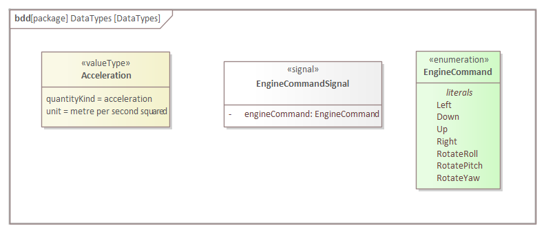

There are some data types that are only used in the functional decomposition. These are the following:

- **Acceleration:** The direction-independent acceleration of the drone.
- **EngineCommandSignal:** A signal containing an **EngineCommand***.
- **EngineCommand:** An enumeration containing the different commands used in the controlling of the engine.

## Task execution system's state machine

The Task Execution System has the following states:
- **Waiting For Task:** The drone hasn't received a task yet and the drone is idling.
- **Waiting For Exception To Be Resolved:** An unexpected problem happened and drone is waiting for it to be fixed by the staff.
- **Executing Task:** The drone is actively carrying out an assigned task in this state. It has 3 substates:
  - **Loading Package:** In this state the drone is at a landing pas. Waiting for the package to be hauled in its container.
  - **Flying:** The drone is delivering a package to the predefined destination or moving towards a pick up station in order to get the package, defined in its task.
  - **Unloading Package:** The drone has arrived to the destination of the task and waiting for the staff to remove the package from its container.

The state machine is influenced by the following Signals:
- **TaskData:** When the drone is in **Waiting For Task** state and this signal comes in the drone goes into **Executing Task** state and starts carrying out the task that is defined in the signal.
- **TaskFinish:** When the drone is in **Executing Task** and receives this signal it goes into **Waiting For Task** state as it has just finished carrying out its task and waiting for a new one to be assigned to it.
- **Exception:** If the drone is in **Waiting For Task** or **Executing Task** state and gets this signal then it goes into **Waiting for Exception To Be Resolved** state. If the drone was waiting for a task then it can't be assigned to a new task until the problem is fixed. If the drone was in progress of carrying out a task and was flying then it proceeds to carry out an emergency landing at a place that it deems safe. If it was loading or unloading a package then it won't start flying until the problem is resolved. Either way the drone waits for the staff to fix the problem.
- **Resolved:** When the drone is in **Waiting for Exception To Be Resolved** state and receives this signal then it goes into **Waiting For Task**. This means that the problem has been fixed and the drone can be assigned to a new task.
- **ArrivedToPickUpStation:** When the drone is in **Flying** state and receives this signal then it goes into **Loading Package** state and waits for a package to be hauled into its container.
- **Loading Finished:** When the drone is in **Loading Package** state and receives this signal then it goes into **Flying** state and starts to deliver the package to its destination.
- **ArrivedToDestination:** When the drone is in **Flying** state and receives this signal then it goes into **Unloading Package** state and waits for the package to be removed from its container.

When the drone receives a task and goes into **Executing Task** state it can go into 2 substates. If the drone is currently at the pick up station defined in the **TaskData** then it goes into **Loading Package** state. If the drone is not there, then it goes into **Flying** state as it needs to travel to the pick up station to get the package.

## Navigation system's state machine

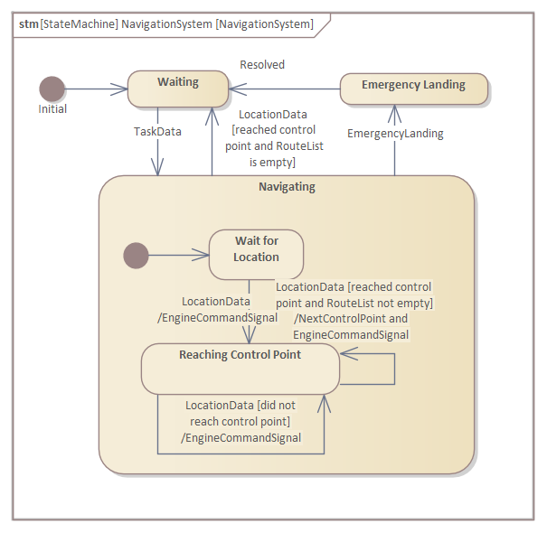

Navigating System has 3 states:
- **Waiting:** The drone doesn't have a destination selected, so the navigation system isn't in use.
- **Emergency Lading:** The drone performed an emergency landing, so the problem leading to the emergency landing has to be solved before the navigation systems output can be used.
- **Navigating:** The drone is flying and the navigation system is in active use. This state can be further decomposed:
  - **Wait for Location:** The system gets the first location data from the sensors' dataflow.
  - **Reaching Control Point:** The system is actively navigating towards a control point, producing directions and commanding the engine.

The state of the navigation system is influenced by the following Signals:
- **TaskData:** When the system receives a new task and is in the **Waiting** state it goes in to **Navigating** and starts navigating towards the targets specified in the task.
- **LocationData:** When the system receives location data and in the **Navigating** state it's start navigating towards the next control point and sending **EngineCommandSignal** signals. If a control point is reached it also sends a **NextControlPoint** signal. If there are no more control points remaining the system goes back to **Waiting**.
- **Emergency Landing:** If the system is in **Navigating** and needs to perform an emergency landing it goes into the **Emergency Landing** state.
- **Resolved:** After the problem leading is resolved the system goes into the **Waiting** state and waits for the next task.

## The behaviour of the navigation system

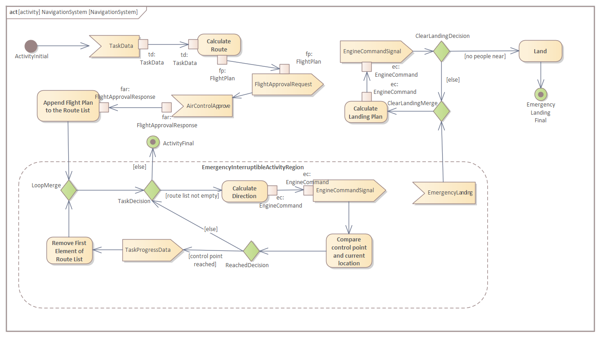

The navigation system first receives a **TaskData** then using with the sensors' data it calculates a flight route and send a request to the Air control to approve it. After the Air Control approves the route the system appends the now control points to the route list. Then the system repeats the following until there are no more control points left: Calculates a **EngineCommandSignal** using the last known location towards the next control point and sends it. If the control point is reached, **TaskProgressData** is sent to the CommunicationSystem and removes the reached control point from the list, else goes back to the direction calculation. If at any point the navigating process receives an **Emergency Landing** signal it repeats the following until it finds a safe landing zone, then lands. It calculates a landing plan then sends a **EngineCommandSignal** signal and checks if there are any people near, using the IR sensor's dataflow.

## The behaviour of the diagnostic system

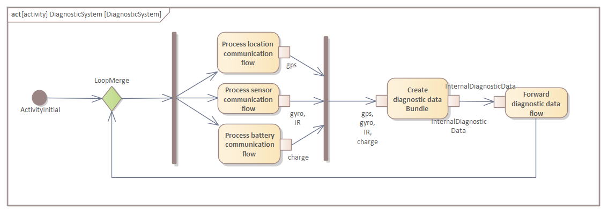

The **Diagnostic System** works iteratively, it sends **Diagnostic Data** continuously using dataflow. It simultaneously collects the sensors' data. Then the **Diagnostic System** processes these given datas separately. When all are available and processed then it bundles them into **Diagnostic Data** and forwards the flow to the **Communication System**.

## The physical model (BDD)

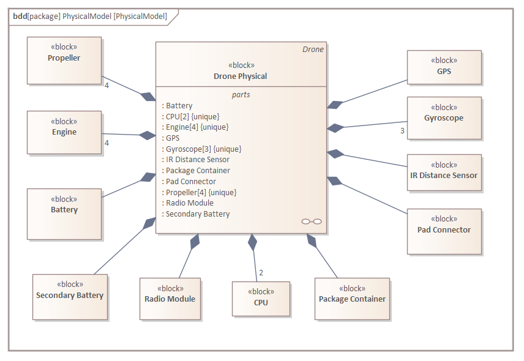

The drone will be containing the following parts: 
- 4 **Propeller**: The drone will be a quadcopter so it will use 4 propellers.
- 4 **Engine**: Each propeller will be driven by a different engine.
- **Battery**: There will be a battery the powers all of the components.
- **Secondary Battery**: In case of the first battery malfunctioning there will be a reserve battery.
- **Radio Module**: The drone will communicate with radio waves during flights.
- 2 **CPU**: All calculations will be performed on an integrated chip. To eliminate single failure errors we will duplicate it.
- **Package Container**: It provides a place for the packages during flights.
- **Pad Connector**: An interface provided by the manufacturer of the landing pads.
- **IR Distance Sensor**: A sensor used to determine if there are any objects nearby.
- **Gyroscope**: A sensor used to determine the orientation and acceleration of the drone.
- **GPS**: A sensor used to determine the location of the drone.

## The physical model (IBD)

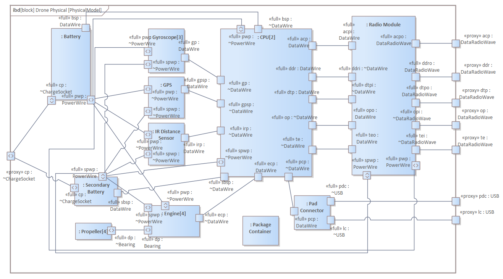

The drone connects to the outer world in 3 ways:
- With a **ChargeSocket** that is used in charging the drones batteries.
- With radios waves that are used to send and receive data and handled by the **Radio Module**.
- With **USB** parts that are used by the **Pad Connector**.

Inside the drone's system there are **PowerWire**s and **DataWire**s. The **PowerWire**s connect almost all components to batteries to receive power from them. The **Propeller**s are connected to the **Engine**s with **Bearing**s and receive power from them. Almost all components are connected to the **CPU**s with **DataWire**s to send data or receive instructions. The **Batteri**es **Gyroscope**, **GPS**, **IR Distance Sensor** and **Pad Connector** send data to the **CPU**. The **Engine**s receive instructions. The **Radio Module** communicates both ways with the **CPU**. The **Package Container** isn't connected to any other components.

## The interfaces of the physical system (BDD)

The Physical system has the following interfaces:
- **DataWire:** It transmits data between components within the system.
- **PowerWire:** It is used transmit power to the components from the **Battery** or **Secondary Battery**. It provides constant flow of power for the system.
- **DataRadioWave:** It is used for the communication between the drone and the world. It emits data as radio waves.
- **USB:** It is used for the connecting the **Pad Connector** (system) and the **Landing Pad**. The system receives package data and loading information through this interface.
- **Bearing:** The **Engine** transforms the received data into physical force and drives the **Propellers** through this interface.
- **ChargeSocket:** It is used for the chareging of the **Battery** and the **Secondary Battery**. It provides constant flow of power for these components.

## System architecture (BDD)

The diagram shows on which physical component each logical function is allocated.
- **Communication System**: It's allocated on the **Radio module**.
- **Power Management System**: It's allocated on both the primary and secondary **Batteri**es.
- **Diagnostic System**, **Task Execution System** and **Route Management System**: They are all allocated on the CPU, because they all need calculations to be made.
- **Package Handling System**: It's allocated on the **Pad Connector** because that's the component where the system sends and receives data regarding packages.
- **Sensor Management**: It's allocated on the **Distance Sensor** and the **Gyroscope**.
- **Location System**: It's allocated on the **GPS**. The location is managed separately from the sensors.
- **Engine Control System**: It's allocated on the **Engine**s.

There are no functions allocated on the **Package Container** and the **Propeller**s.