# Assignment 3

## Stakeholders (UC)


 - **Customer:** Orders the product and uses it for delivery by sending task assignments.
 - **Landing Pad Provider:** Provides Landing Pads for picking-up and delivering packages. Also responsible for charging drones.
 - **Operators:** Operators can override the flight of the drone in special cases.
 - **Maintenance:** Receives diagnostic data and repairs drones if necessary.
 - **Air Control:** Monitors the path of the routes and other flying objects. It can command the operators to change the routing plan. Air control also tracks the drone's location via it's satellite system.
 - **Legislation**: UAVs are regulated by the Delegated Regulation 2019/945 and the Act No. XCVII on aviation in Hungary.

## Requirements (REQ)

We have identified several functional and extra-functional requirements from a couple of stakeholders.

### Functional requirements


Most of the expectations towards the system came from the customer. We broke them down and it resulted in the following requirements:
- **F01 Autonomous Flight**: The drone must be able to execute the flight plan autonomously (including navigation and controlling the device), even in case of a data-connection error.
- **F02 Receive Assignment**: The system must be able to receive assignments from the central computer.
- **F03 Report Progress**: The drone must report its progress regarding the current assignment to the central computer.
- **F04 Landing Vertically**: The drone must be able to land vertically.
- **F05 Flight Interruptable**: The operators must be able to interrupt the flight.
- **F06 Flight Plan Modifiable**: The operators must be able to modify the flight plan.
- **F07 Report Flight Plan Change**: The system must report any changes in the flight plans to the air control.
- **F10 Follow Flight Plan**: The drone must remain in the $10 m$ vicinity of the pre-declared flight plan. 
- **F11 Maximum Flight Height**: The drone must not fly higher than $200 m$.

There were also some expectations coming from the Air Control, which resulted in the following requirements:
- **F08 Landing Spots**: The drone must land on designated landing spots.
- **F09 Avoid Prohibited Areas**: The flight plan must not cross prohibited areas.

### Extra-functional requirements

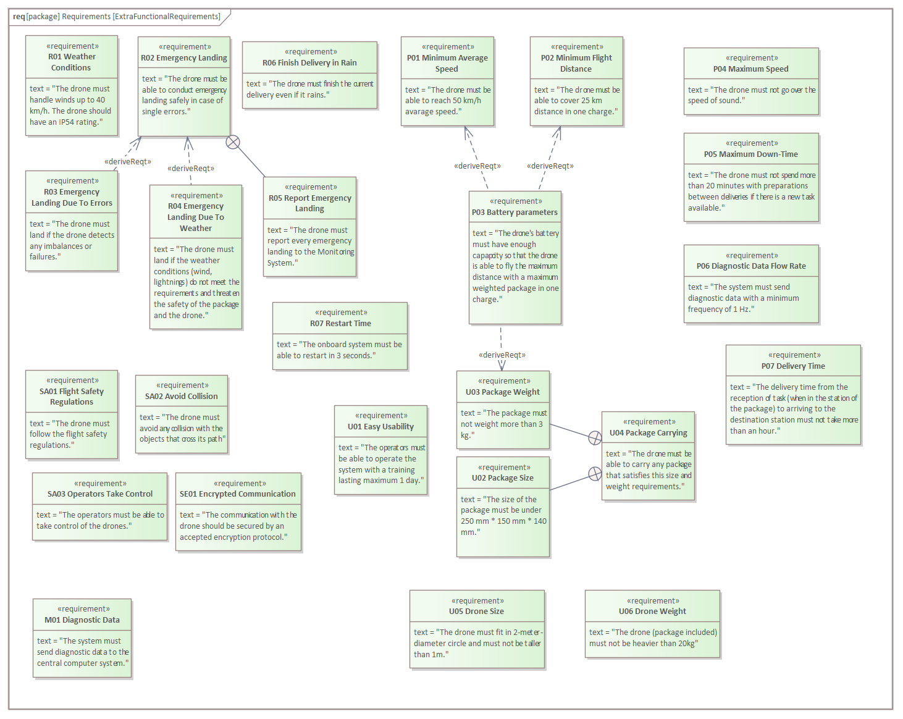

Expectations from the costumer and Air Control both resulted in extra-functional requirements and we as designers of the system also added some. We further classified the extra-functional requirements to these categories:

#### Usability

- **U01 Easy Usability**: The operators must be able to operate the system with a training lasting maximum $1$ day.
- **U02 Package Size**: The size of the package must be under $250~mm \cdot 150~mm \cdot 140~mm$.
- **U03 Package Weight**: The package must not weight more than $3~kg$.
- **U04 Package Carrying**: The drone must be able to carry any package that satisfies this size and weight requirements.
- **U05 Drone size**: The drone must fit in $2$-meter-diameter circle and must not be taller than $1~m$.
- **U06 Drone weight**: The drone (package included) must not be heavier than $20~kg$.

#### Reliability

- **R01 Weather Conditions**: The drone must handle winds up to $40~km/h$. The drone should have an IP54 rating. We added this requirement, but we didn't find any specifications regarding the weather conditions in which the drone should be operable, so we went with our estimation.
- **R02 Emergency Landing**: The drone must be able to conduct emergency landing safely in case of single errors.
- **R03 Emergency Landing Due To Errors**: The drone must land if the drone detects any imbalances or failures.
- **R04 Emergency Landing Due To Weather**: The drone must land if the weather conditions (wind, lightnings) do not meet the requirements and threaten the safety of the package and the drone.
- **R05 Report Emergency Landing**: The drone must report every emergency landing to the Monitoring System.
- **R06 Finish Delivery in Rain**: The drone must finish the current delivery even if it rains.
- **R07 Restart Time**: The onboard system must be able to restart in $3$ seconds.

#### Performance

- **P01 Minimum Average Speed**: The drone must be able to reach $50~km/h$ avarage speed. In the specification we only found that the round-trip time should be low as possible, so we went with our estimation.
- **P02 Minimum Flight Distance**: The drone must be able to cover $25~km$ distance in one charge. We added this requirement, but we didn't find any specifications regarding the minimum flight distance, so we went with our estimation.
- **P03 Battery parameters**: The drone's battery must have enough capacity so that the drone is able to fly the maximum distance with a maximum weighted package in one charge.
- **P04 Maximum Speed**: The drone must not go over the speed of sound.
- **P05 Maximum Down-Time**: The drone must not spend more than $20$ minutes with preparations between deliveries if there is a new task available.
- **P06 Diagnostic Data Flow Rate**: The system must send diagnostic data with a minimum frequency of $1~Hz$.
- **P07 Delivery Time**: The delivery time from the reception of task (when in the station of the package) to arriving to the destination station must not take more than an hour.

#### Safety

- **SA01 Flight Safety Regulations**: The drone must follow the flight safety regulations.
- **SA02 Avoid Collision**: The drone must avoid any collision with the objects that cross its path.
- **SA03 Operators Take Control**: The operators must be able to take control of the drones.

#### Maintainability

- **M01 Diagnostic Data**: The system must send diagnostic data to the central computer system.

#### Security
- **SE01 Communication Encrypted**: The communication with the drone should be secured by an accepted encryption protocol.

### Connections between the requirements

The **Report Flight Plan Change** further specifies what should happen when the flight plan is modified, so it's contained by **Flight Plan Modifiable**.

Similarly **Report Emergency Landing** further specifies a part of the emergency landing process so it's contained by **Emergency Landing**.

There are also connections between **Emergency Landing Due To Errors**, **Emergency Landing Due To Weather** and **Emergency Landing**, because they define when an emergency landing should be conducted.

**Package Carrying** contains **Package Size** and **Package Weight**, because they are used in it.

**Battery parameters** is connected to **Minimum Average Speed**, **Minimum Flight Distance** and **Package Weight**, because they are all influencing the required battery.

## Use cases (UC)
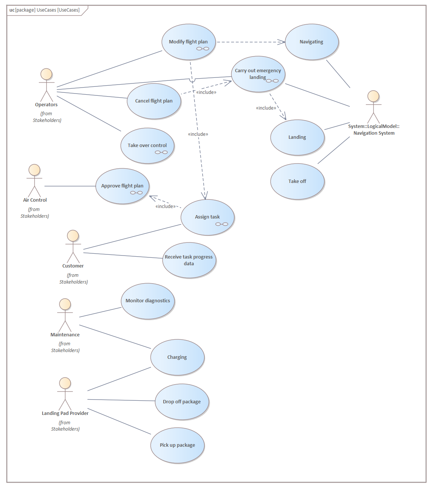

- Operators have four roles. 
  - They are able to modify flight plans that always overrides the current one. In some emergency cases like weather change, modifying means temporarily staying at a landing pad and then continue its delivery. 
  - Operators can also cancel the flight plan, which must include a path to a landing pad. Air Control can only override the flight through operators.
  - Operators can also take over the control of the drone if necessary (as required by some reqiurements)
  - Operators can initiate an emergency landing, if they deem it necessary.
- The air control team can approve or deny flight plans created by the drone's navigation system. The corresponding use cases defines both.
- The customer can assign a task that always means a modification in the flight plan (a new flight plan is created). This flight plan must always be approved by the Air Control. They also receive the task progress in percentage.
- Maintenance monitors diagnostics. They are also able to charge the drones. (We didn't take repairing as a use-case.)
- The landing pad providers (more specifically their docking stations) can load packages into the drone's container. They can also removed them and charge the drones.

The former use case of the customer (assigning a new task for the drone) is further elaborated below. The task assignment is sent as TaskData that is described in the corresponding section. For the process, the customer's computer uses the Remote Control system.


### Use Case Scenarios

As the Use Case Scenarios were written in full sentences, we consider the screenshots as documentation.

#### Assign Task

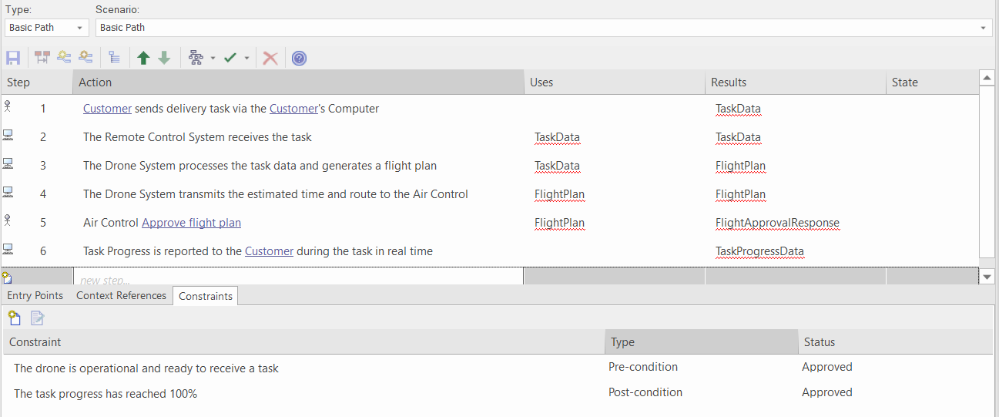
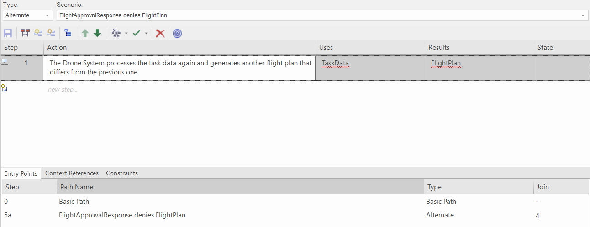

#### Modify Flight Plan

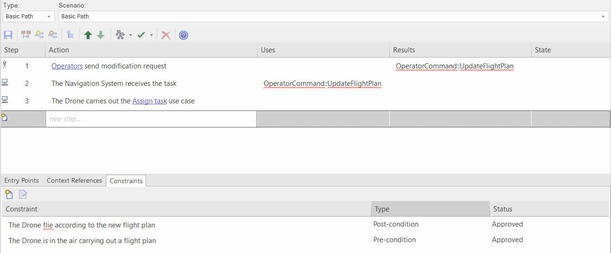

#### Carry Out Emergency Landing

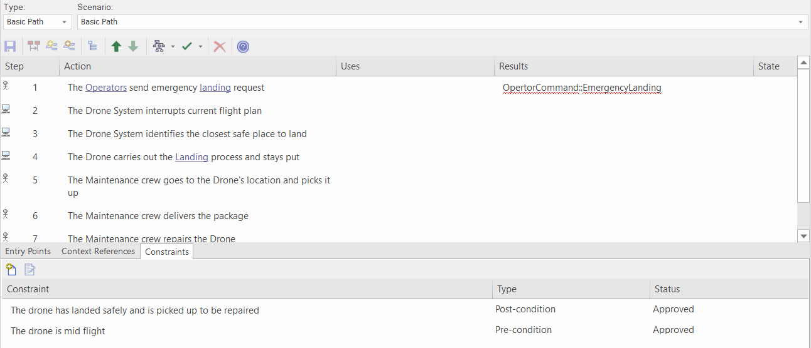
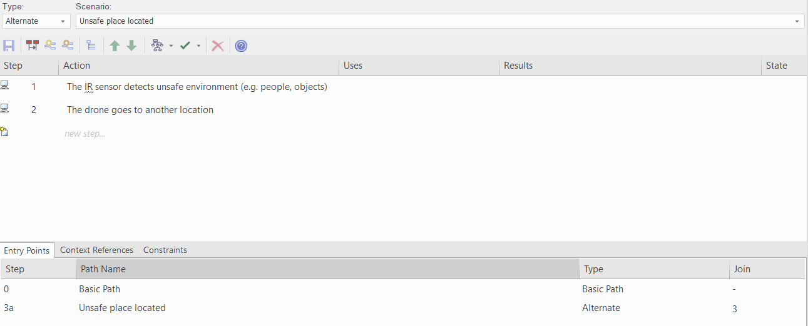

#### Cancel Flight Plan

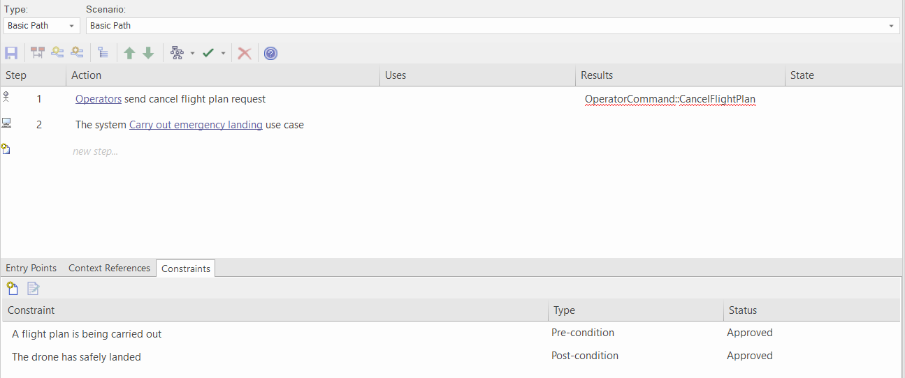

#### Take Over Control

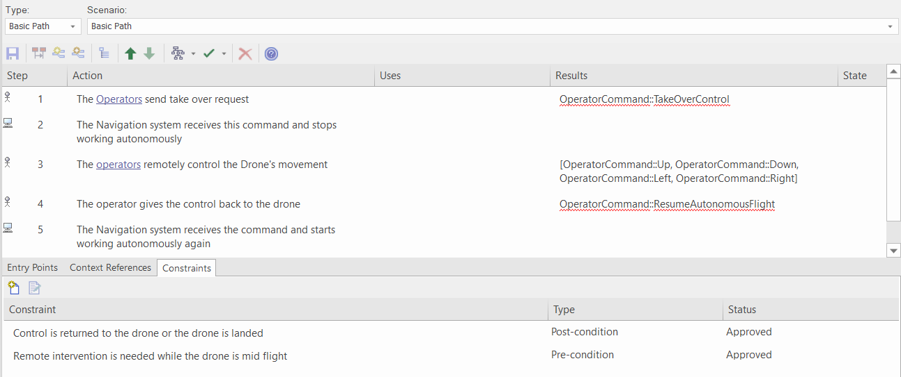

#### Approve Flight Plan

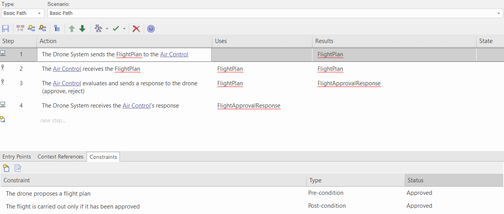

#### Monitor Diagnostics

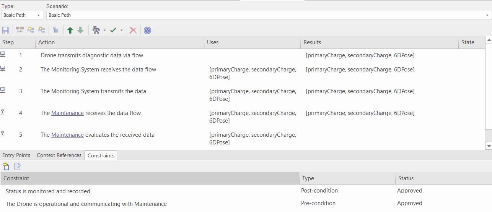

#### Pick Up Package

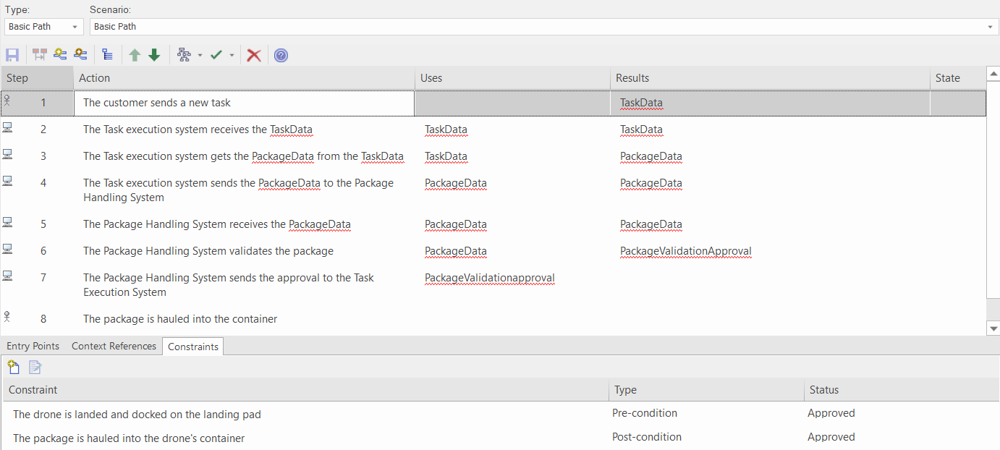
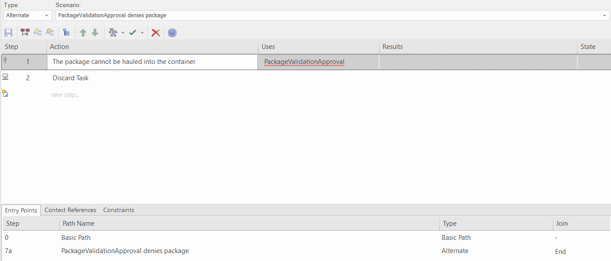

## Sequence Diagrams

### Approve Flight Plan Sequence Diagram


These two diagrams model the communication among components and stakeholders within the Approve Flight Plan use case. The drone's Navigation System initiates the communication by sending a FlightPlan signal to the Communication System. The Communication System then transmits this signal towards the Air Control. The Air Control can either Approve (shown in the first picture) or deny (shown in the second picture) the FlightPlan. They send a FlightApprovalResponse signal (containing their decision) to the Communication System which then transmits it to the Navigation System.

### Assign Task Sequence Diagram


At first the Customer sends a Taskdata signal to the Communication System which transmits it to the Task Execution System. Then the Task Execution Systme sends a PackageData signal to the Package Handling System which decides wether the package can be transported. If it deems fit, then it sends a PackageDataValidationApproval signal (with a true argument) back to the Task Execution System. After this the Task Execution System sends the TaskData to the Navigation System which will deal with the planning of routes and communication with the Air Control.

### Modify Flight Plan Sequence Diagram


The communication of the modification is started by the Operators. They send a CommandSignal with and UpdateFlightPlan argument to the Communication System which forwards this to the Navigation System. After this the communication of the Assign Task starts which was discussed earlier.

### Carry Out Emergency Landing Sequence Diagram.


The Operators initiate this communication with a CommandSignal with the argument of EmergencyLanding. The Communication System receives this and forwards it to the Navigation System, which carries out the emergency landing. It constantly sends EngineCommandSignal to the Engine Control System with arguments that it deems fit based on its inner components' data.

### Take Over Control Sequence Diagram


The Operators send a CommandSignal with the argument of TakeOverControl to the Communication System which forwards this to the Navigation System. Then the Drone is constantly waiting for orders from the Operators. They send CommandSignals to the Navigation System via the Communication System. Then the Navigation System sends EngineCommandSignals to the Engine Control System according to the argument of the received CommandSignal. The loop ends with CommandSignal with the argument of ResumeAutonomousFlight sent by the Operators to the Communication System which forwards this to the Navigation System.

## System context (BDD)


- **Remote Control:** Operators and the customer can communicate with the drones and the drone sends progress information to the customer via this component. This component belongs to our company. 
- **Monitoring System:** Proxy server between the customer and the drone for the customer to receive diagnostic data.
Both the monitoring system and remote control aim to provide an easily usable interface while ensuring sensitive information security as well.
- **Customer Computer:** The customer's system that communicates with the remote control and monitoring system. Represents the customer.
- **Package:** The package that the drone delivers. Has to fit in the drone's container.
- **Landing Pad:** The drone delivers packages between landing pads, also charging its battery on them. Loading and unloading is carried out automatically, provided by outer company.
- **Environment:** Consists of Weather (e.g. wind and ice conditions) and the Air Route. The drone must take into consideration these circumstances while planning and completing tasks.
- **Drone:** Represents the drone's whole system.
- Operators, Maintanance and Air Control represent the stakeholders that communicate with our system.

## System context (IBD)
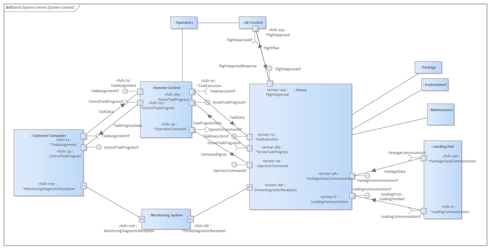


The Drone communicates with the Customer Computer via the Monitoring System and the Remote Control.

The Drone receives the task/delivery via its TaskExecution port. The Drone has DroneTaskProgress port which is used for sending progress data to the Remote Control. The Drone has an OperatorCommand port that is used to receive commands from the Remote Control. These commands are sent by the operators. The Drone also has DroneDiagnosticReception port for sending diagnostic data (continuously, with a frequency of at least 1 Hz) to the Monitoring System. This communication is represented as a data flow, because data is flowing frequently, and continuously.
The Drone has 7 interfaces for each of its ports. The Remote Control and Monitoring System have the corresponding ports for the communication.

The Customer Computer has the following ports: TaskAssignment, ControlTaskProgress and MonitoringDiagnosticReception. These are important for receiving and sending the information discussed earlier.
These ports communicate through different interfaces with the Monitoring System and the Remote Control than the Drone does, allowing unified and secured communication with the Drone. The Remote Control and Monitoring System have the corresponding ports for the communication.

The Drone receives data about the Environment including the weather conditions and observes its surroundings through sensors.

The Maintenance has continuous contact with the Drone due to repairing.

The drone has contact with the package during delivery. The package is loaded into the drone's container. The docking station (landing pad) sends a finished signal and error signals (in case of error) to the drone's system. It also sends data about the package. This communication with the Landing Pad is during picking up or delivering a package, or charging.

Air Control can modify the drone's route through Operators. Operators are able to control the Drone's behaviour using the Remote Control. The air control team can also send flight plan approvals to the drone so that it can start it route.

## Data types of the system context (BDD)
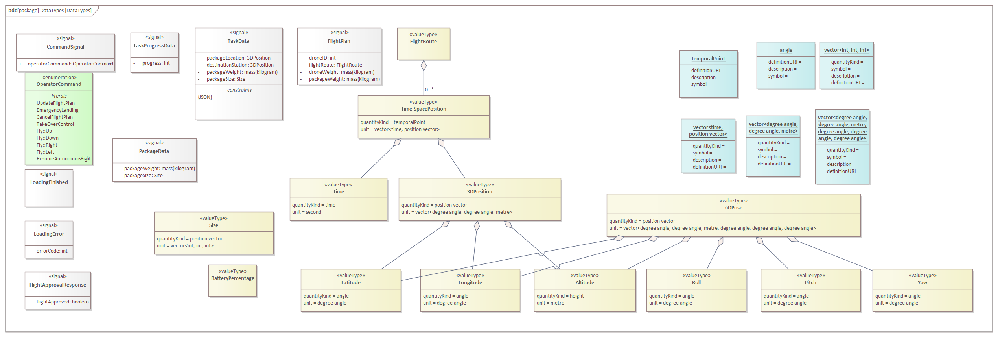

- **CommandSignal:** This signal is used by Remote Control to send OperatorCommand to the Drone.
- **OperatorCommand:** enumeration representing the commands that the Operation can send. The command options are: updating flight plan (UpdateFlightPlan), conduct emergency landing (EmergencyLanding), cancel flight plan (CancelFlightPlan). These commands are also used by the operators to take the control over the drone (TakeOverControl) and control its movements afterwards (Fly::Up, Fly::Down, Fly::Right, Fly::Down). The takeover can be finished by sending ResumeAutonomousFlight command.
- **TaskData:** This signal consists of the source pad's location (the pad where the package is initially stored), the destination pad's location (where the package needs to be delivered) and the weight and size of the package to be delivered. The task description is sent by the customer in JSON format.
- **TaskProgressData:** This signal represents the actual task's progress data. It contains an integer that represents the percentage of the delivery.
- **FlightPlan:** This signal represents the flight plan created by the drone's navigation system. It contains the drone's ID, the created route itself and the basic data of the package that is to be delivered.
- **PackageData:** This signal is for sending basic data about the package. This is used by the lading pad (docking station).
- **LoadingFinished and LoadingError:** These are signal used by the lading pad to indicate the end of loading process and the errors occured during the process.
- **FlightApprovalResponse:** This signal is sent when communicating between the drone and the air control directly. The request's result (true/false) is returned.  
- **3DPosition:** This value type represents the location of the given object (Drone, Landing Pad, etc.) in three dimensions with a vector of the followings: Latitude and Longitude are provided in degree angle, while Altitude means the height of the object above the sea level in metres.
- **6DPose:** This is a vector value that contains location coordinates as well as rotation values (roll, pitch, yaw) as indicated on the figure above. The rotation values are angle values in degrees.
- **FlightRoute:** This value type represents the flight route itself. It consists of some temporal points (Time-SpacePosition) that describe a timestamp (Time) and a location (3DPosition).
- **Size:** This value type describes the size of the package as a 3D vector. The x,y and z components of the vector are the width, height, and depth of the package in millimetres.
- The other boxes represent quantity kinds that are used for temporal points and for angles. There are custom units for vectors decribed above.

## Logical/Functional system (BDD)

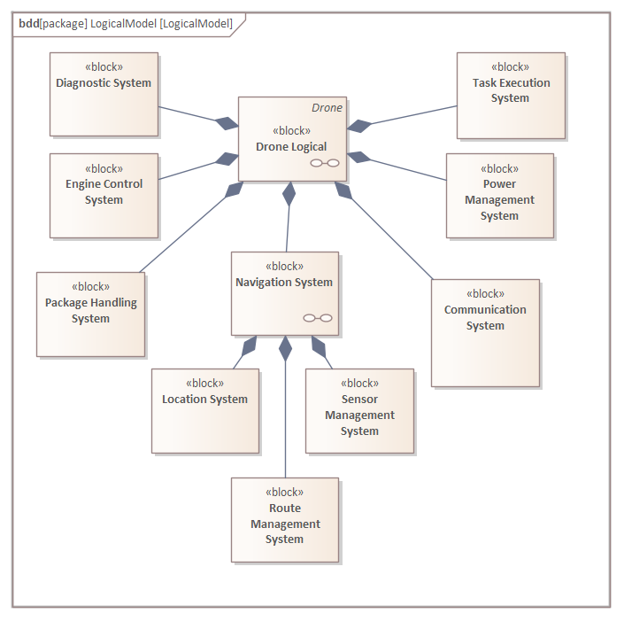

- **Diagnostic System:** This component is responsible for processing telemetry data sources (sensor data, etc.) and send them to the communication module.
- **Engine Control System:** This component controls the engine by receiving commands and power it.
- **Package Handling System:** This is the subsystem of the drone that receives the package data from the landing pad (docking station) and processes them.
- **Task Execution System:** This component is responsible for receiving the description of task assignment and forward it to the navigation system. This component is also responsible for checking if the task has the correct format and contains valid data.   
- **Power Management System:** This component handles the primary and secondary batteries. It continuously monitors their health and if the primary breaks down or if it drains, this system automatically switches the power source. It also provides the telemetry data related to the batteries.
- **Communication System:** This component provides communication between the internal subsystems of the drone and the other devices. It is able to process wireless signals and forward them to the corresponding internal components.
- **Navigation System:** This is a complex subsystem that provides several functions.
  - **Location System:** This subsystem is responsible for providing location data of the drone continuously.
  - **Sensor Management System:** This subsystem handles the sensors (gyroscope, IR sensor, etc.). It also provides diagnostic data related to the sensors it handles.
  - **Route Management System:** This subsystem creates and the flight plan and executes it (controls the engine) while sending data about the task's progress. It is also responsible for executing only approved flight plans.

## Logical/Functional system (IBD)

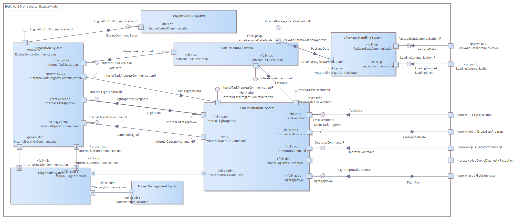

### Package Handling System

The **Package Handling System** component receives signals from the pick up station while the drone waits for the package to be hauled into its container. It has three ports. Via the **PackageDataCommunication** port it receives data about the package. Through the **LoadingCommunication** port it receives information about the states of the loading procedure. Through **InternalPackageDataValidation** it sends answer to the **Task Execution System** upon request about the validity.

### Diagnostic System

It receives data from the **Navigation System** via its **InternalSensorCommunication** and **InternalLocationCommunication** ports. It also receives data about the battery level from the **Power Management System** via its **BatteryCommunication** port. The subsystem bundles these datas together and sends it to **Communication System** through the **InternalDiagnosticData** port.

### Task Execution System

This subsystem receives **TaskData** from the **Comunication System** via its **InternalTaskExecution** port and forwards it to the **Navigation System** to begin the planning of the flight if the **TaskData** are valid. Through **InternalPackageDataValidation** it sends a request to the **Package Handling System** to validate package data. It also validates the stations of the task.

### Communication System

This subsystem connects the other components with the outer world. It receives **TaskData** through its **TaskExecution** port and forwards it to its **InternalTaskExecution** port. Similarly **OperatorCommands** arriving on the **OperatorCommand** port are forwarded to the **InternalOperatorCommand** port. Through the **FlightApproval** port the drone is able to communicate with the **Air Control**. The subsystem can receive **FlightPlan** on its **InternalFlightApproval** port and forwards it to its **FlightApproval** port. On the same port it can also receive **FlightApprovalResponse** from the **Air Control** and it forwards this signal to its **InternalFlightApproval** port. From the **Navigation System** it can reveive **TaskProgressData** via its **InternalTakProgressCommunication** port and forwards it to its **DroneTaskProgress** port. Finally, it receives diagnostic data from the **Diagnostic System** through its **InternalDiagnosticData** and forwards it to its **DroneDiagnosticReception** port.

## Navigation system (IBD)

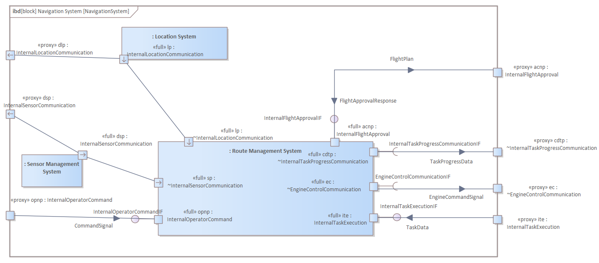

The Navigation System has 3 components/subsystems.

### Route Management System

It receives information about a task via the **InternalTaskExecution** port. It provides connection with the **Task Execution System**.  It is basically used to start the planning of a flight. The **InternalOperatorCommand** port is another port from which the system can be commanded. Operators can modify or cancel a flight via this port. 

The subsystem sends the progress data out via its **TaskProgressCommunication** port. With this the outside world is able to receive information about the task that is being carried out. It also communicates with the **Engine Control System** via its **EngineControlCommunication** port and sends signals to it to control the movement of the drone.

The subsystem recevies data from the other 2 components of the **Navigation System**. It receives data from the **Location System** through the **InternalLocationCommunication** port. It receives data from the **Sensor Management System** via the **InternalSensorCommunication** port. The subsystem uses these datas during the planning and executing of a flight route.
The sensors' dataflow is continuous.

This subsystem is also in connection with the **Air Control** via the **InternalFlightApproval** port. It provides full-duplex connection, the subsystem sends out the proposed **FlightPlan** and receives a response from the **Air Control** in form of a **FlightApprovalResponse** signal.

### Location System

This subsystem manages the location data of the drone. It has only one port, the **InternalLocatorCommunication**. Via this port it sends out location data to the **Route Management System** as well as to the outer **Diagnostic System** component.

### Sensor Management System

This subsystem manages the sensor data of the drone. It has only one port, the **InternalSensorCommunication**. Via this port it sends out sensor data to the **Route Management System** as well as to the outer **Diagnostic System** component.

## Interfaces of the logical/functional sytem (BDD)

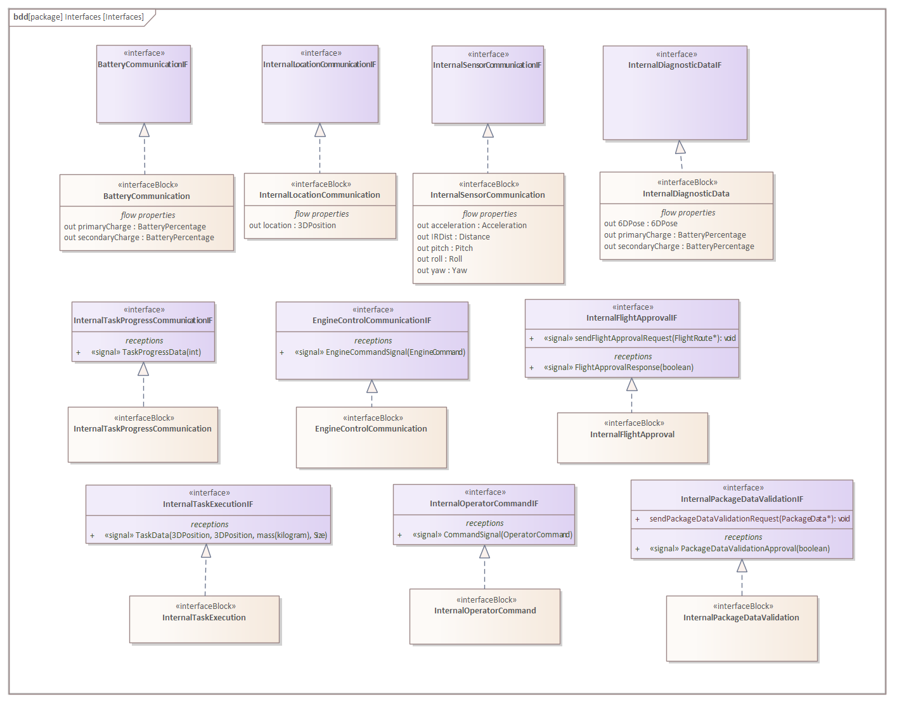 

The diagram above shows the interfaces used by the components in the functional decomposition.
There are 2 types of interfaces:

### Interfaces sending out data

The following interfaces are implemented by components that produce and send out data to other components. The data production is usually continuous so it's modelled by flows.

- **BatteryCommunication:** The battery management module sends out 2 types of data: a primary and a secondary charge percentage.
- **InternalLocationCommunication:** In the navigation subsystem the location module can send location data.
- **InternalSensorCommunication:** Similarly to the location the sensor management can send data containing 5 metrics: acceleration, pith, roll, yaw gathered from the Gyroscope and IRDist gathered from the IR Sensor.
- **InternalDiagnosticData:** The diagnostic module can send 3 types of data: 6D positions, primary and secondary battery percentages.

### Interfaces receiving signals 

The following interfaces are implemented by components that can receive and be controlled by different signals. 

- **InternalTaskProgressCommunication:** The task progress can be reported using the **TaskProgress** signal.
- **EngineControlCommunication:** The controlling of the engine is achieved with **EngineCommandSignal**s.
- **InternalFlightApproval:** The route handling can send flight approval request to the Air Control. The result of these requests are returned in **FlightApprovalResponse** signals.
- **InternalTaskExecution**: Internally the data regarding a delivery is transferred in **TaskData** signals.
- **InternalOperatorCommand**: The commands received from operators internally are transformed to **CommandSignal**s.
- **InternalPackageDataValidation:**: The **TaskExecutionSystem** can send package data approval request to the **PackageHandlingSystem**. The result of these requests are returned in **PackageDataValidationApproval** signals.

## Data types of the logical/functional system (BDD)

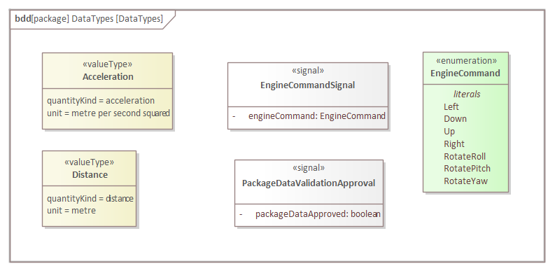

There are some data types that are only used in the functional decomposition. These are the following:

- **Acceleration:** The direction-independent acceleration of the drone.
- **Distance:** Distance measured in metres, used for the IR sensor's measurement.
- **EngineCommandSignal:** A signal containing an **EngineCommand***.
- **EngineCommand:** An enumeration containing the different commands used in the controlling of the engine.
- **PackageDataValidationApproval:** A boolean value for approving the validity of the loaded package's information.

## Task Validation and execution activity

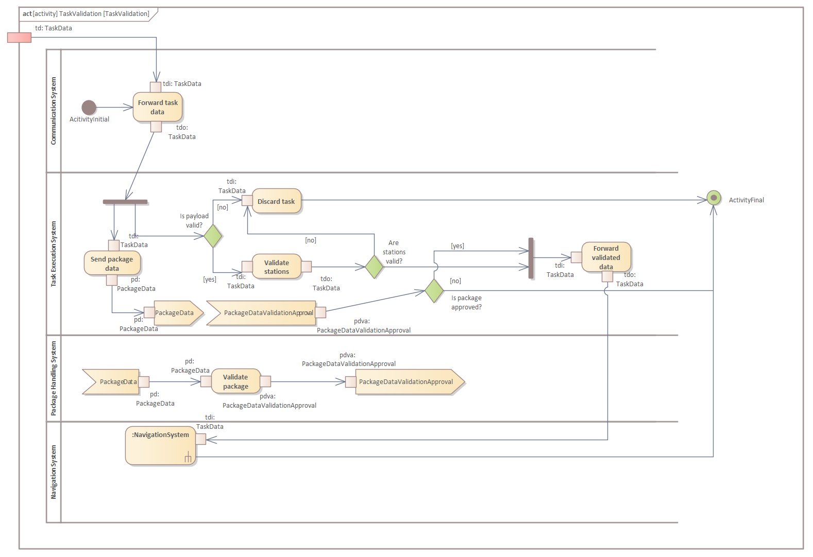

The Task Data arrives at the Drone and the **Communication System** forwards it to the **Task Execution System** using the internal interface.

The task is validated in two separate flow. The **Package Data** is sent to the **Package Handling System** which validates the **Package Data** and sends a signal that contains if the package is approved. Simultaneously the **Task Execution System** validates the payload format and the stations.

If either the format, the stations or the package data are invalid, the Task is discarded. Otherwise the validated TaskData is forwarded to the **Navigation System**.

## Task execution system's state machine

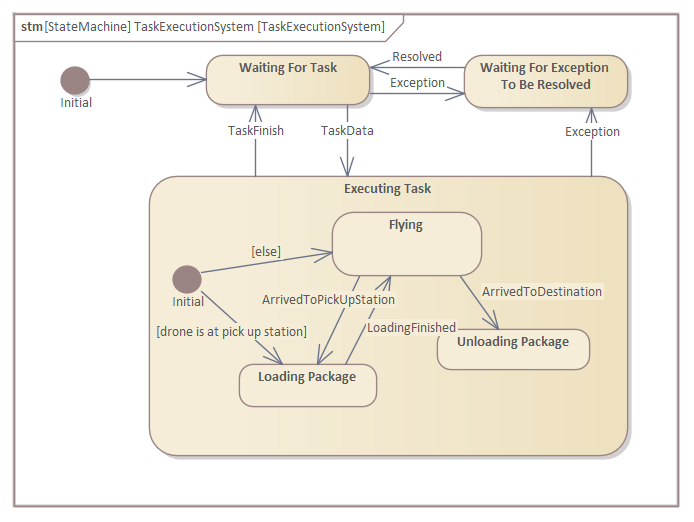

The Task Execution System has the following states:
- **Waiting For Task:** The drone hasn't received a task yet and the drone is idling.
- **Waiting For Exception To Be Resolved:** An unexpected problem happened and drone is waiting for it to be fixed by the staff.
- **Executing Task:** The drone is actively carrying out an assigned task in this state. It has 3 substates:
  - **Loading Package:** In this state the drone is at a landing pas. Waiting for the package to be hauled in its container.
  - **Flying:** The drone is delivering a package to the predefined destination or moving towards a pick up station in order to get the package, defined in its task.
  - **Unloading Package:** The drone has arrived to the destination of the task and waiting for the staff to remove the package from its container.

The state machine is influenced by the following Signals:
- **TaskData:** When the drone is in **Waiting For Task** state and this signal comes in the drone goes into **Executing Task** state and starts carrying out the task that is defined in the signal.
- **TaskFinish:** When the drone is in **Executing Task** and receives this signal it goes into **Waiting For Task** state as it has just finished carrying out its task and waiting for a new one to be assigned to it.
- **Exception:** If the drone is in **Waiting For Task** or **Executing Task** state and gets this signal then it goes into **Waiting for Exception To Be Resolved** state. If the drone was waiting for a task then it can't be assigned to a new task until the problem is fixed. If the drone was in progress of carrying out a task and was flying then it proceeds to carry out an emergency landing at a place that it deems safe. If it was loading or unloading a package then it won't start flying until the problem is resolved. Either way the drone waits for the staff to fix the problem.
- **Resolved:** When the drone is in **Waiting for Exception To Be Resolved** state and receives this signal then it goes into **Waiting For Task**. This means that the problem has been fixed and the drone can be assigned to a new task.
- **ArrivedToPickUpStation:** When the drone is in **Flying** state and receives this signal then it goes into **Loading Package** state and waits for a package to be hauled into its container.
- **Loading Finished:** When the drone is in **Loading Package** state and receives this signal then it goes into **Flying** state and starts to deliver the package to its destination.
- **ArrivedToDestination:** When the drone is in **Flying** state and receives this signal then it goes into **Unloading Package** state and waits for the package to be removed from its container.

When the drone receives a task and goes into **Executing Task** state it can go into 2 substates. If the drone is currently at the pick up station defined in the **TaskData** then it goes into **Loading Package** state. If the drone is not there, then it goes into **Flying** state as it needs to travel to the pick up station to get the package.

The previous State Machine was further refined into DroneLogicalStateMachine, which represents the entire system's state machine.
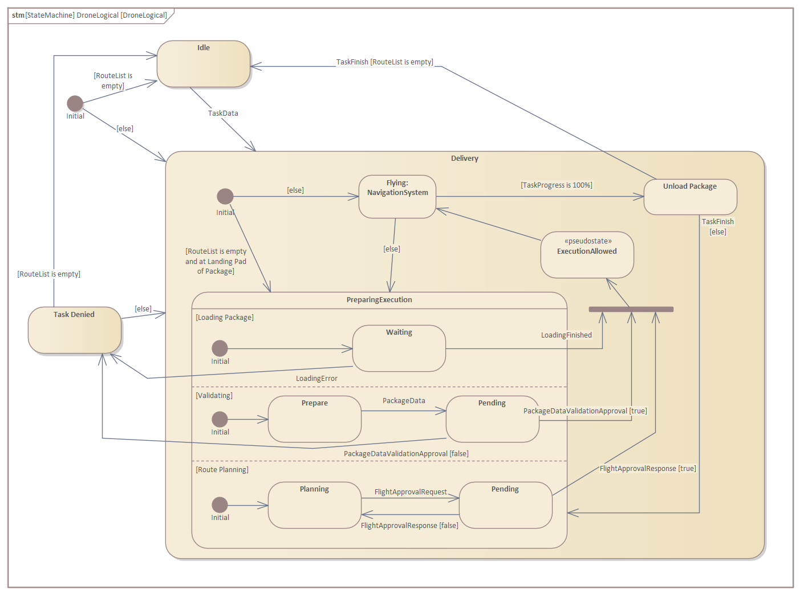
Modifications: Preparing with 3 regions which end in a pseudostate, Flying exchanged for NavigationSystem's state machine. Checking if there has other TaskData's arrived, allowing multiple Deliveries.

## Navigation system's state machine

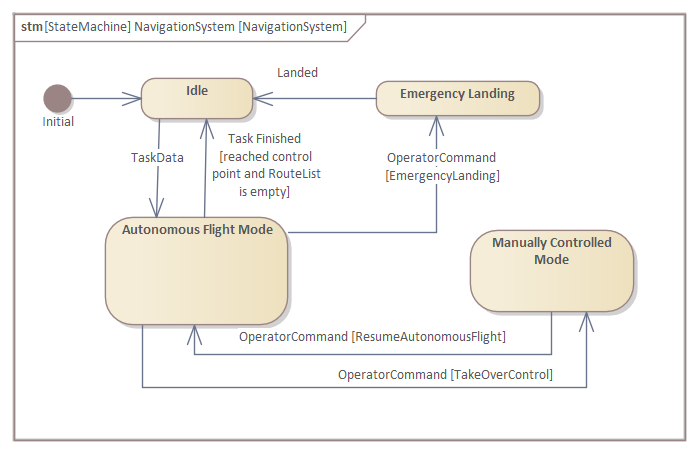

Navigating System has 3 states:
- **Idle:** The drone doesn't have a destination selected, so the navigation system isn't in use, the drone is on the ground.
- **Emergency Lading:** The drone performed an emergency landing, so the problem leading to the emergency landing has to be solved before the navigation systems output can be used.
- **Autonomous Flight Mode:** The drone is flying and the navigation system is in active use.

The state of the navigation system is influenced by the following Signals and Events:
- **TaskData:** When the system receives a new task and is in the **Waiting** state it goes in to **Navigating** and starts navigating towards the targets specified in the task.
- **Task Finished:** When the system receives location data and in the **Autonomous Flight Mode** state it's start navigating towards the next control point and sending **EngineCommandSignal** signals. If there are no more control points remaining the system goes back to **Idle**.
- **OperatorCommand with Emergency Landing:** If the system is in **Autonomous Flight Mode** and needs to perform an emergency landing it goes into the **Emergency Landing** state.
- **Landed:** After the emergency landing is resolved the system goes into the **Idle** state and waits for the next task.
- **OperatorCommand with TakeOverControl:** The Drone's autonomous flight stops and is controlled manually by an operator.
- **OperatorCommand with ResumeAutonomousFlight:** The Drone's autonomous flight starts and stops being controlled manually.

The previous State Machine was renewed in later iteration of design, in order to be able to reused in DroneLogicalStateMachine.

The updated version:
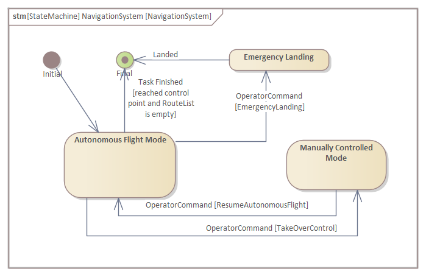
Changes: Idle State was moved to DroneLogicalStateMachine and refined for multiple Task reception.

## The behaviour of the navigation system

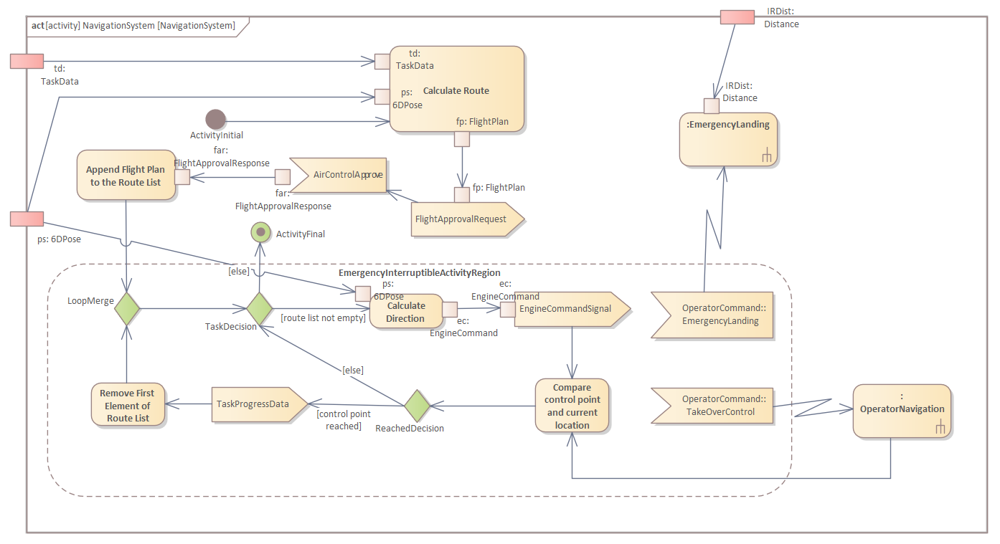

The navigation system first receives a **TaskData** and **6D Pose** through data flow, with which it calculates a flight route and sends a request to the Air control to approve it. After the Air Control approves the route the system appends the now control points to the route list. Then the system repeats the following until there are no more control points left: Calculates a **EngineCommandSignal** using the last known location towards the next control point and sends it. If the control point is reached, **TaskProgressData** is sent to the CommunicationSystem and removes the reached control point from the list, else goes back to the direction calculation.
- If at any point the navigating process receives an **Emergency Landing** signal the Drone carries out an Emergency landing.
- If at any point the navigating process receives an **OperatorCommand** signal with **TakeOverControl** data it switches to manually controlled mode. It can resume autonomous driving after **OperatorCommand** signal with **ResumeAutonomousFlight** data.
- We can observe that this operation results in forward recovery of the navigation.


During emergency landing the Drone repeats the following until it finds a safe landing zone, then lands. It calculates a landing plan then sends a **EngineCommandSignal** signal and checks if there are any people near, using the IR sensor's dataflow.

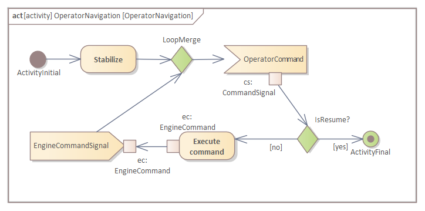
In controlled mode, the drone stabilizes itself, and then waits for an OperatorCommand and executes it in an infinite loop. If the command is **ResumeAutonomousFlight**, the activity ends, continouing its normal workflow.

## The behaviour of the diagnostic system

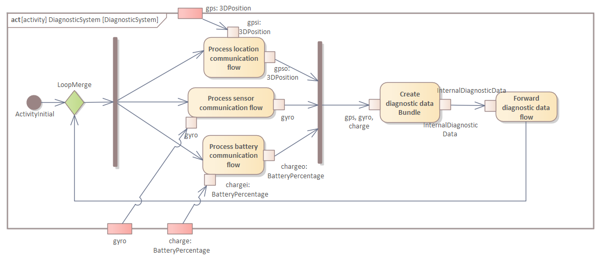

The **Diagnostic System** works iteratively, it sends **Diagnostic Data** continuously using dataflow. It simultaneously collects the sensors' and batteries' data. Then the **Diagnostic System** processes these given datas separately. When all are available and processed then it bundles them into **Diagnostic Data** and forwards the flow to the **Communication System**.

## The physical model (BDD)

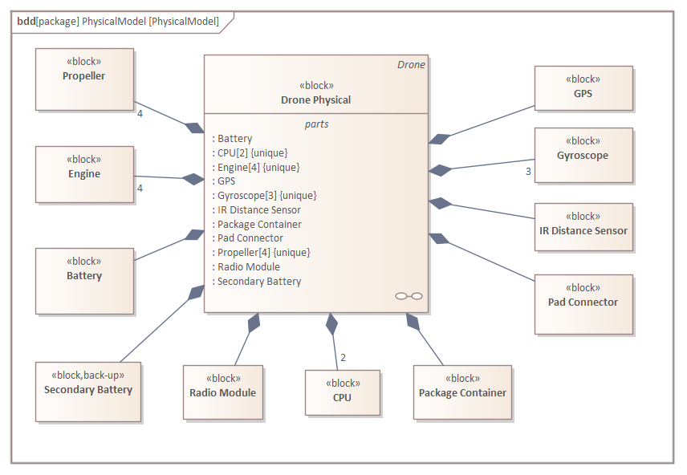

The drone will be containing the following parts: 
- 4 **Propeller**: The drone will be a quadcopter so it will use 4 propellers.
- 4 **Engine**: Each propeller will be driven by a different engine.
- **Battery**: There will be a battery the powers all of the components.
- **Secondary Battery**: In case of the first battery malfunctioning there will be a reserve battery.
- **Radio Module**: The drone will communicate with radio waves during flights.
- 2 **CPU**: All calculations will be performed on an integrated chip. To eliminate single failure errors we will duplicate it.
- **Package Container**: It provides a place for the packages during flights.
- **Pad Connector**: An interface provided by the manufacturer of the landing pads.
- **IR Distance Sensor**: A sensor used to determine if there are any objects nearby.
- **Gyroscope**: A sensor used to determine the orientation and acceleration of the drone.
- **GPS**: A sensor used to determine the location of the drone.

## The physical model (IBD)

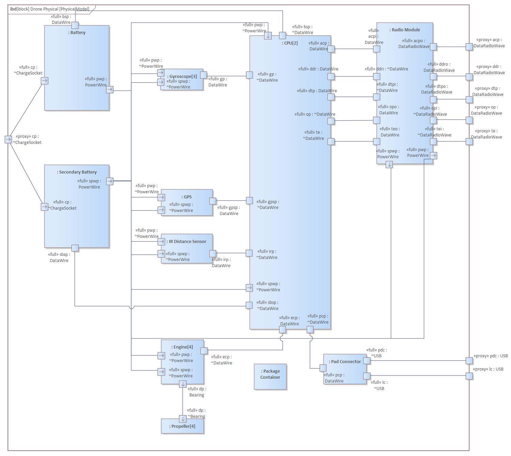

The drone connects to the outer world in 3 ways:
- With a **ChargeSocket** that is used in charging the drones batteries.
- With radios waves that are used to send and receive data and handled by the **Radio Module**.
- With **USB** parts that are used by the **Pad Connector**.

Inside the drone's system there are **PowerWire**s and **DataWire**s. The **PowerWire**s connect almost all components to batteries to receive power from them. The **Propeller**s are connected to the **Engine**s with **Bearing**s and receive power from them. Almost all components are connected to the **CPU**s with **DataWire**s to send data or receive instructions. The **Batteri**es **Gyroscope**, **GPS**, **IR Distance Sensor** and **Pad Connector** send data to the **CPU**. The **Engine**s receive instructions. The **Radio Module** communicates both ways with the **CPU**. The **Package Container** isn't connected to any other components.

## The interfaces of the physical system (BDD)

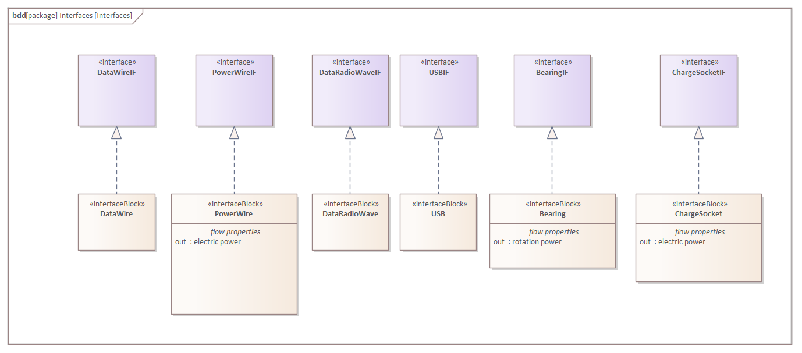

The Physical system has the following interfaces:
- **DataWire:** It transmits data between components within the system.
- **PowerWire:** It is used transmit power to the components from the **Battery** or **Secondary Battery**. It provides constant flow of power for the system.
- **DataRadioWave:** It is used for the communication between the drone and the world. It emits data as radio waves.
- **USB:** It is used for the connecting the **Pad Connector** (system) and the **Landing Pad**. The system receives package data and loading information through this interface.
- **Bearing:** The **Engine** transforms the received data into physical force and drives the **Propellers** through this interface.
- **ChargeSocket:** It is used for the chareging of the **Battery** and the **Secondary Battery**. It provides constant flow of power for these components.

## System architecture (BDD)

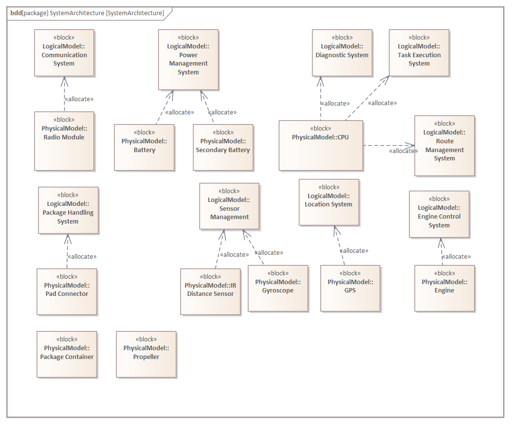

The diagram shows on which physical component each logical function is allocated.
- **Communication System**: It's allocated on the **Radio module**.
- **Power Management System**: It's allocated on both the primary and secondary **Batteri**es.
- **Diagnostic System**, **Task Execution System** and **Route Management System**: They are all allocated on the CPU, because they all need calculations to be made.
- **Package Handling System**: It's allocated on the **Pad Connector** because that's the component where the system sends and receives data regarding packages.
- **Sensor Management**: It's allocated on the **Distance Sensor** and the **Gyroscope**.
- **Location System**: It's allocated on the **GPS**. The location is managed separately from the sensors.
- **Engine Control System**: It's allocated on the **Engine**s.

There are no functions allocated on the **Package Container** and the **Propeller**s.

## Port allocation (IBD)

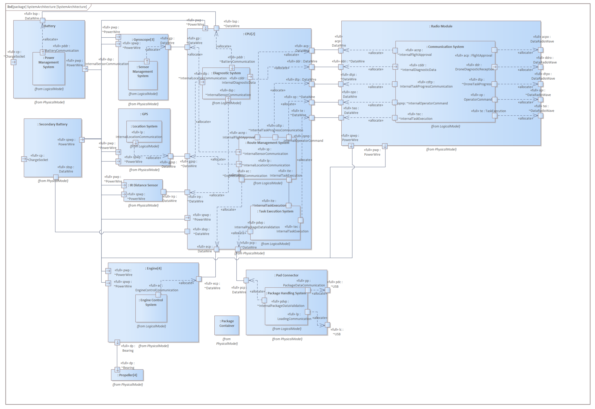

The diagram shows on which physical port each logical port is allocated. For most of the ports the allocation is trivial, because there is only 1 connection between the physical components that realize the logical functions. The logical ports can only be allocated to **DataWire** ports, because they always represent some kind of data flow.

Between the **CPU** and the **Radio Module** there are multiple physical connections. The following logical connections each have a dedicated physical channel: flight approval requests, diagnostic data, communication about the task progress, operator commands, task execution.

## Fault Tree Analysis

During the fault tree analysis, we modeled and decomposed 3 major faults into subconditions.

#### Note

For all three faults, it is true that if neither battery is working, the fault will occur. We could have included this as part of the top-level OR gate with a separate Battery subtree, but instead, we decided to attach it directly to each physical component.

This does not affect the statistical result; we simply wanted to express semantically that the operation of each component individually depends on the battery, not just the system as a whole.

Additionally, this approach makes the model more extensible in case a component has its own separate battery rather than being connected to the same power source. Or if we want to consider that the battery supplies power to each component through separate wires, where the wire itself can also be a failure point. Different components' wires may also present varying levels of risk depending on load and length.

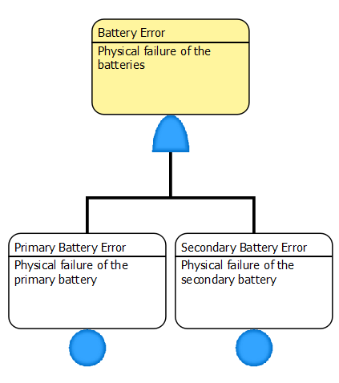

* A battery-related failure occurs if both the primary and secondary batteries fail (AND gate).
* Primary Battery: Panasonic NCR18650 GA, λ = 1.39e-10
* Secondary Battery: Tattu 65 15C LiPo, λ = 1.389e-9
* Since the secondary battery is rarely used and only for a short time, we chose a somewhat simpler battery for it.

### Diagnostic Error

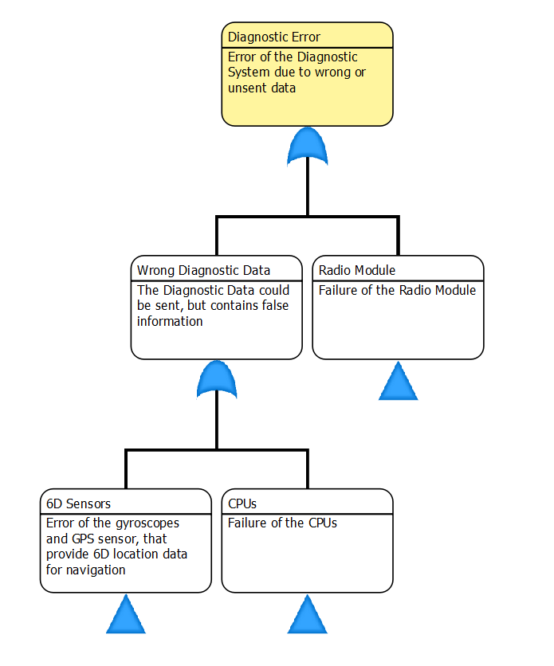

Error of the Diagnostic System due to incorrect or unsent data.

* Wrong data may arise either from sensor malfunctions or from improper data packaging by the CPUs.
* Since a wrong diagnostic packet can result from any sensor or CPU failure, we used an OR gate to group them.
* Data transmission failures primarily result from the Radio Module malfunctioning.

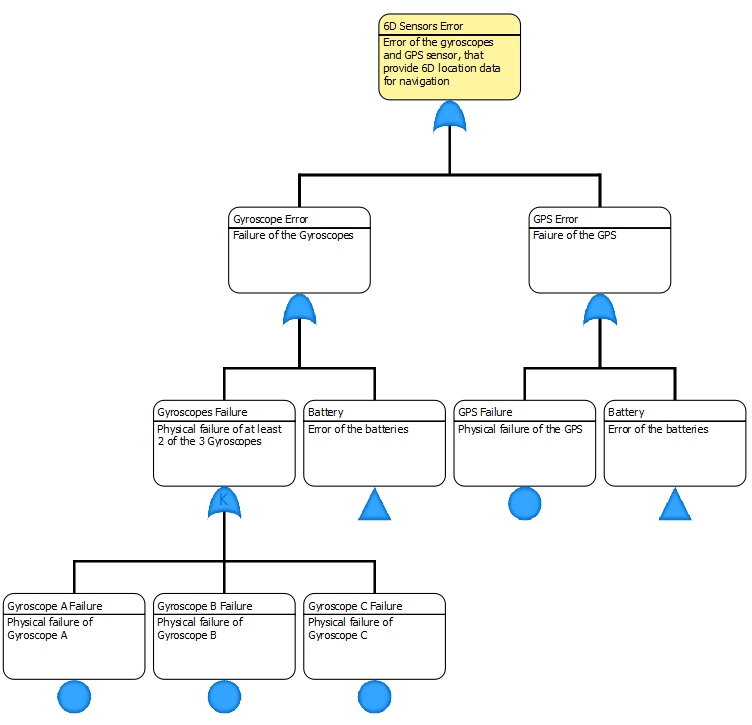

* Since we don’t transmit data from the IR sensor, only the Gyroscope and GPS are included under 6D Sensors transfer.
* For fault tolerance, we included three Gyroscopes in our system and use a voter to ensure proper function even if one gyroscope fails (the CPUs take this into account).
* GPS has better fault tolerance, so we did not include redundancy for it in the current plan.
* Gyroscope: Kacise KS3ARG02D, Kh MTBF = 10, λ = 2.7778e-8
* GPS: 3DM-RQ1-45, Kh MTBF = 180, λ = 1.543e-9

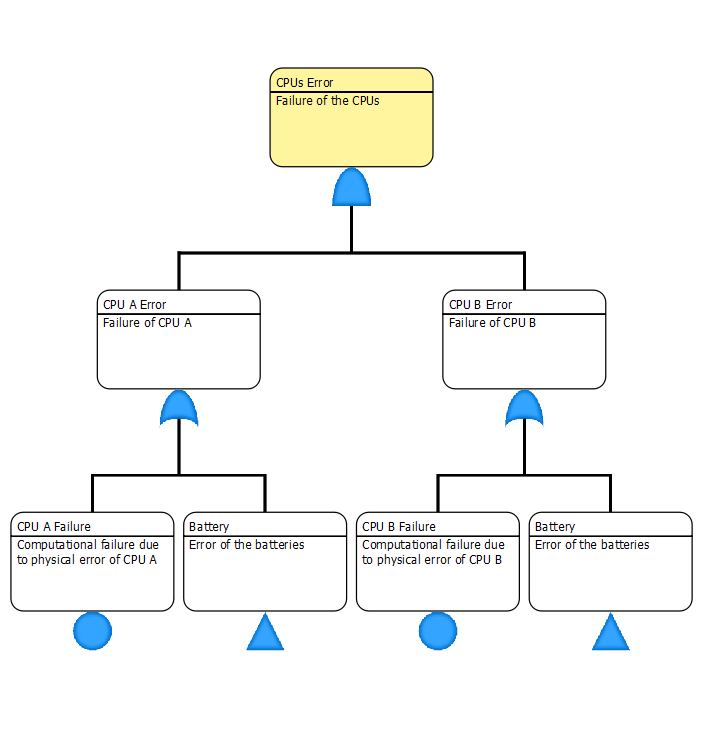

* For fault tolerance, we use two central controllers in the drone. If one fails, the other can continue to operate, so we connected the failure of the two CPUs with an AND gate.
* We only considered physical failures, assuming the software has been properly verified and validated to ensure correct operation.
* CPU: SIL2, λ = 2.78e-10

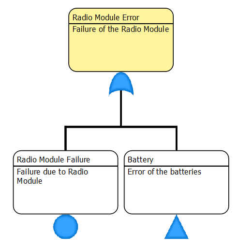

* The radio may fail physically (or, like other components, due to battery failure).
* Radio Module: RLX-FHS, λ = 3.64e-10

### Navigational Error

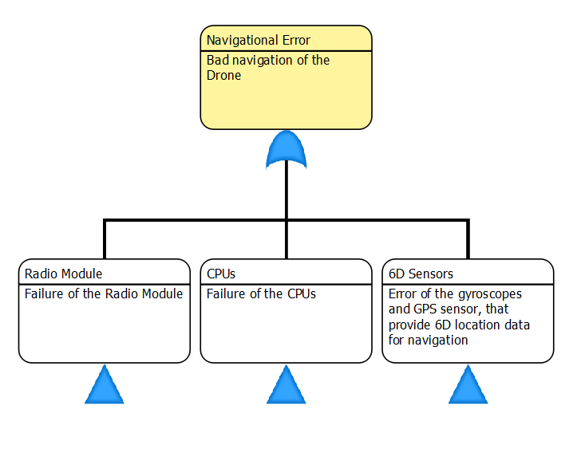

Bad navigation of the Drone

* Essentially identical to the Diagnostic Error fault tree.
* The hierarchy was different only because the component groupings were based on the type of error, but this does not affect the statistical result.
* The similarity between the two fault trees shows that regular diagnostic data transmission is important, as it provides a strong indication of proper system functioning. (Except in the case where the drone operates correctly but a data packet is lost over the network. This risk will be analyzed later in the Performance Analysis section.)

#### Analysis

As mentioned earlier, the Navigational Error and Diagnostic Error are statistically identical, so we only document one of them.

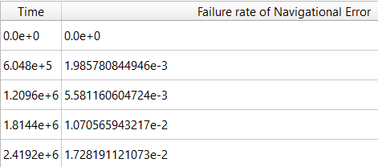

* Evaluation time: 4 weeks, with weekly steps.
* Probability of failure within 2 weeks: 5.58e-3 → 0.558%
* Probability of failure within one month: 1.73e-2 → 1.73%

Minimal cut sets:

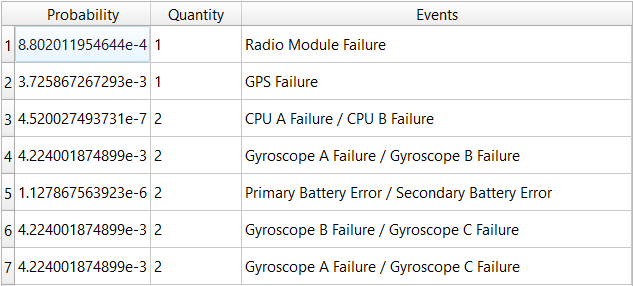

Evaluation:

* The most likely cause of failure is sensor malfunction.
* Considering that:
  
  * these sensors often produce only transient faults and return to normal operation
  * with proper use of diagnostic data and regular monitoring, faults can be detected and potential serious losses avoided

  the function appears well thought-out and operational.

### Landing

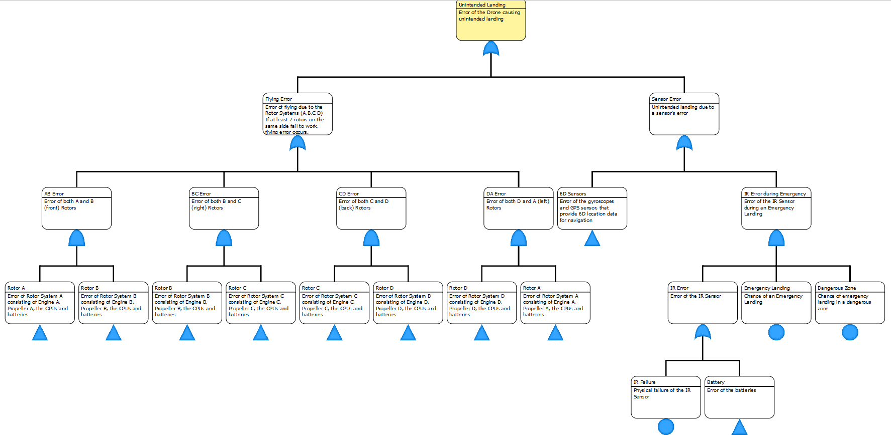
Error of the Drone causing unintended landing

* Improper operation during flight and the resulting dangerous landing (crash/uncontrolled or incorrect descent) can occur due to two main reasons.

Firstly, due to malfunctioning sensors. The 6D Sensors are crucial for drone control. Additionally, the installed IR sensor is necessary in the case of an Emergency Landing. This only causes an error if there is an emergency landing, the sensor is faulty, and the drone attempts to land in a location where it shouldn’t (e.g., a person is nearby). Therefore, we connected these with an AND relationship.

* IR Sensor: BFS-U3-50S5M, λ = 6.883e-9
* Emergency Landing Distribution: 2.77778e-7
* Dangerous Zone Distribution: 2.77778e-6
* Although the last two are constant distributions estimated by us, they indicate the insignificance of the error well and would remain negligible even with much stricter estimates compared to the flight components.

Secondly, due to failures in the flight components (CPUs, Engines, Propellers).

* The drone was designed with 4 Propellers located at its four corners, each driven by a separate engine (the pair is referred to as a Rotor), and each engine is controlled by the same central CPU units.
* From this design decision, it follows that the failure of any two Rotors on the same side causes problems; 1 rotor or 2 opposite Rotors failing does not. Naturally, Diagnostic Data allows for detecting some form of failure, so even the failure of one propeller could lead to an Emergency Landing or switching to manual control.
* In the fault tree, Rotors A and C as well as B and D are the diagonals, so we excluded those combinations. Any single failure does not cause issues, and if more than 2 Rotors fail, at least one of the listed combinations will occur.
* The CPU failure could have been moved up in the OR hierarchy, as with the Battery, but due to the same reasoning discussed under Battery, we added CPU as a separate condition to each Rotor.

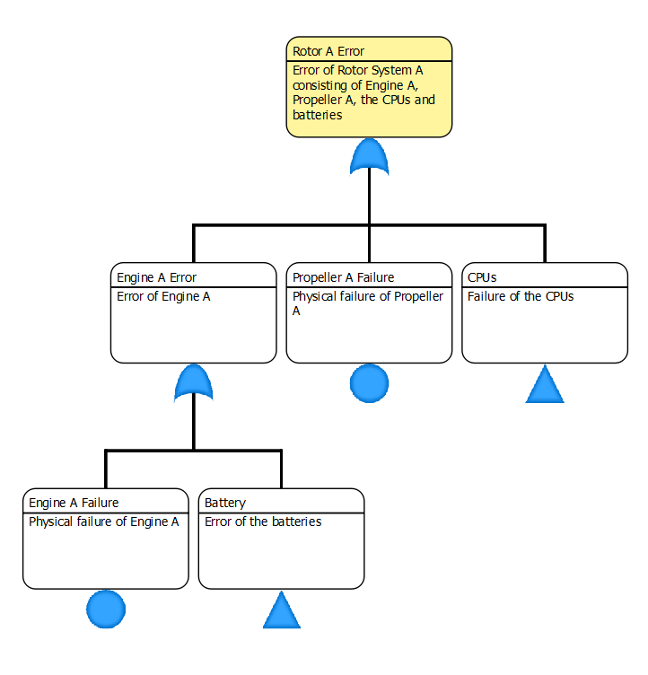

Each Rotor's fault tree looks the same, with its own Propeller and Engine.

* A Rotor fails if its Engine, Propeller, or the shared CPUs fail.
* The Engine, being an electrically powered component, is also dependent on Battery failures (as is the CPU, but that is already included in the sub-tree).
* Engines: MN505-S IP45, λ = 9.2593e-8
* Propellers: Mejzlik Carbon Fiber 16x5.4, λ = 2.4074e-8

#### Analysis

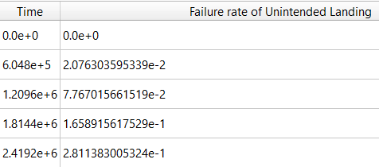

* Observation period: 4 weeks in weekly steps
* Failure probability over 2 weeks: 7.77e-2 → 7.77%
* Failure probability over one month: 2.81e-1 → 28.1%

Minimal cut sets:

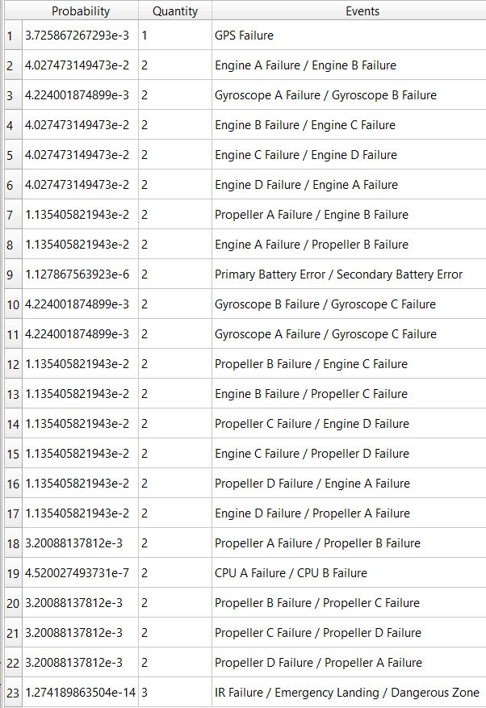

Evaluation:

* The most likely cause of failure is rotor malfunction.
* The failure probability is significantly higher than desirable.
* Reasons:

  * Sensor failures, as described in the previous analysis, do not necessarily lead to immediate dangerous landings. A variable could be added to represent whether the error was undetected, which would lead to an unsuccessful Emergency Landing. Although we can only estimate this probability currently, there are certainly appropriate metrics that could be used.
  * In the Rotor failure, we included both the Engine and the Propeller as fault factors. This is likely necessary since both components can indeed fail. However, we could only estimate the probability of rotor failure, which may have been overly strict.
  * Just as sensor faults can be detected, rotor failures can be too. Thus, they don’t automatically lead to a dangerous landing either.
  * Operators always inspect the drone’s condition at each station, so failures due to loose screws or other physical damage can be prevented (see FMEA), as such problems typically develop gradually over time rather than occurring instantly. (This too could be modeled as a conditional AND estimate alongside the failure.)
  * Drones are not expected to operate 24 hours a day but only for a fraction of that time (see Performance Analysis), meaning the 2-week operation actually represents a much longer time span.
  
* Based on the above, we conclude that the drone could likely be further improved for better fault tolerance — for instance, by using redundant or more robust components — but it is also clear that our current level of analysis can be refined in depth to better reflect real-life conditions. This would allow for more accurate estimation of severe failure rates (e.g., by using metrics to define the distribution of prevention failures or other risk-enhancing circumstances).
* Observing the Minimal Cut Sets, our system has no single point of failure.

## Failure Mode and Effects Analysis (FMEA)

We made the analysis in an Excel document. Due to the fact, that we did not only used a title and the 4 numbers that describe the analysis but also made columns to each aspect with explanations, we take the Analysis itself to serve as a documentation.

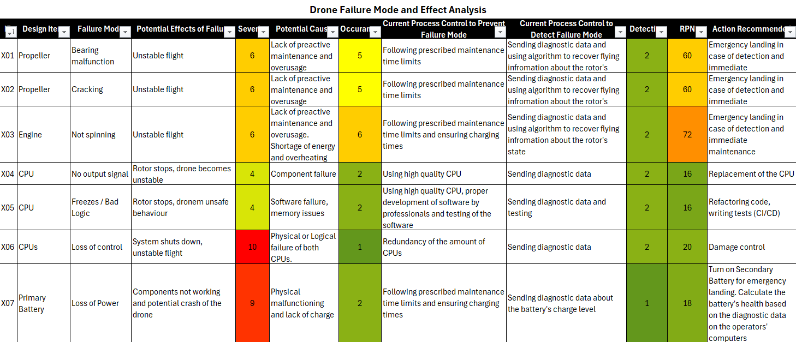
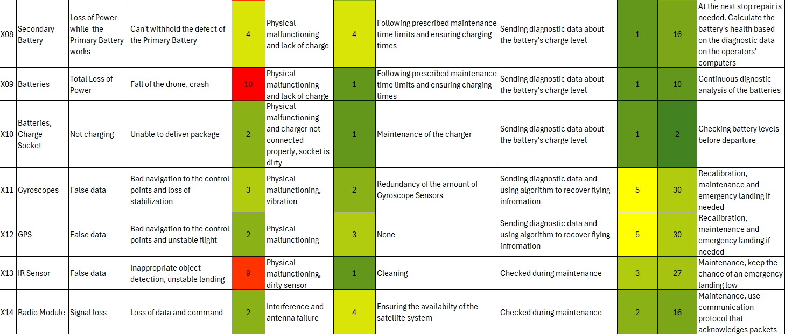
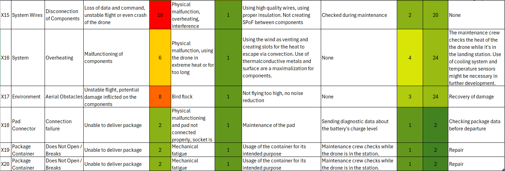

In the decreasing order of RPN we can also show, that the Failures align according to the Pareto-principle, making the minority of failure modes responsible for the majority of failure effects.

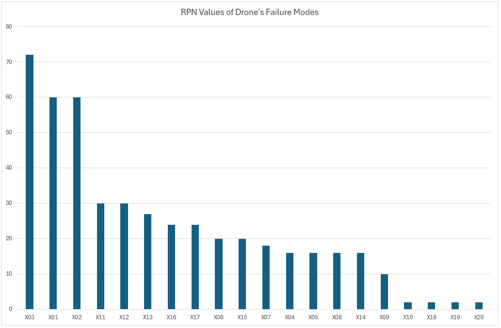

## Performance Analysis

### Package Delivery Pipeline
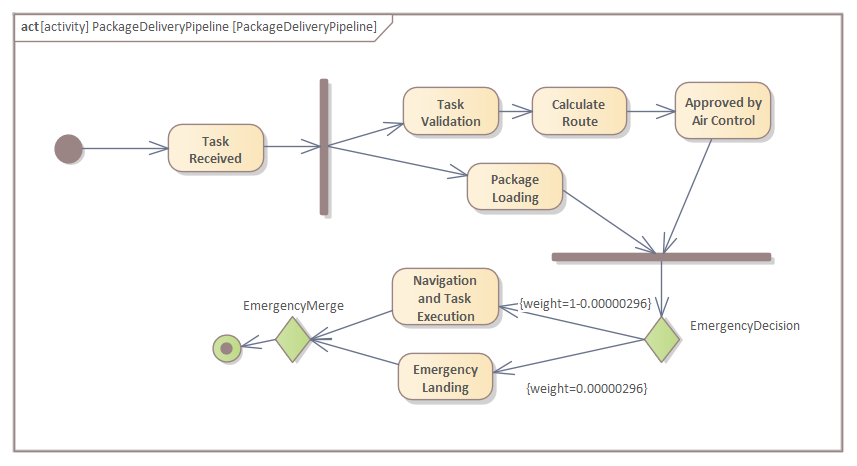

In the following section we calculate the time of a Drone Delivery in order to prove P07 requirement that says the delivery time from the reception of task (when in the station of the package) to arriving to the destination station must not take more than an hour.

Each message's route via mobile network takes approximately 100 ms.

- **Task Received** therefore takes 200 ms from the Costumer's computer to the Drone.
- Before flight, the Drone Validates the task (100 ms), calculates a route (30 s) and the Air Control approves it (200 ms + 60 s). Paralelly to it, due to P05 requirement the package is loaded at most in 20 minutes. Since this is paralell, we can take the maximum of the two processing times (20 min).
-  The distance that the drone needs to take is 25 km at most (P02). Since the average speed is at least 50 km/h (P01) a perfect delivery takes 30 minutes.
-  In the route plan neighbouring control points are maximum 10 metres from each other (F10). Since the Navigational Error's likelihood is extremely low and the correction of the mistake takes just a few seconds, we didn't take it into count.
-  In case of delivery error, the drone needs maintenance, and it is  taken to a mainenance centre. The package is delivered by the maintenance, therefore it takes 3 hours to finish the delivery.
-  Using the Fault Tree of the Unintended Landing, during this period of time (1800 s) the likelihood of an unintended landing is $2.96*10^{-6}$. An unintended landing means 3 hours of extra time in the delivery.
-  Expected time of the flight: $2.96*10^{-6} * 60 * 60 * 3 + (1-2.96*10^{-6}) * 60 * 30 = 1800,02664 s$.

Estimated Task Delivery : 200 ms + 20 min + 30 min ≈ 50 min

We took into account the truth of other Performance Requirements, which also needs to be proved. (Engine is strong enough to reach the estimated average speed with the drone's weight. Battery is strong enough to give power for that for 30 mins.)

In this task, we take these requirements as granted.

### Service Performance

One drone's performance: 6/5 = 1.2 delivery / hour --> 28 full delivery / day
Having 100 drones: 2800 delivery / day (Maximal throughput)

In case of 1680 deliveries per day, the utility is 60% resulting in a well-planned service without saturated operation, meaning we can satisfy 70 deliveries per hour stably. (task input rate).

This can be optimised further with horizontal scaling, producing more drones (and keeping spare drones).

### Diagnostic Data Flow Rate

In the following section we will prove P06 requirement, which says the system must send diagnostic data with a minimum frequency of 1 Hz.


As we can see in the **Diagnostic System**'s activity, 3 different sensors' data is needed to create the package and forward it to the **Monitoring System**.

The sensor data arrives in dataflow, but the sensors' frequency rates matter. We need to take the lowest frequency as an estimation of data arriving time.

- Kacise KS3ARG02D Gyroscope data uploading rate: 2000 Hz
- 3DM-RQ1-45 GPS data uploading rate: 500 Hz
- Panasonic NCR18650 GA Battery's Sensor data uploading rate: 1000 Hz

Lowest sensor rate: 500 Hz --> 2 ms delay
- Bundling the package: 50 ms
- Sending the data with **Radio Module** via mobile network: 100 ms

Total response time: 152 ms

Likelihood of Diagnostic Data Error in every second: $1.9 * 10^{-9}$

In one second we send at least 6 diagnostic data packages. The chance of not delivering a single correct diagnostic data in a second is: $(1.9 * 10^{-9} )^6 ≈ 4.7*10^{-53}$

This likelihood is supercalifragilisticexpialidociously low, ensuring that the drone will send diagnostic data with 1 Hz during it's total lifetime with a great chance.

## Simulation

This section covers the main concepts and details of the drone's simulation context and the specific constraints that were created for a selected requirement. The selected requirement is F04: The drone must be able to land vertically. Since there are no further detailed constraints for the landing speed, it can be set to a specific value for the simulation reflecting the drone's configuration aspect by the customer.

### Simulation data types
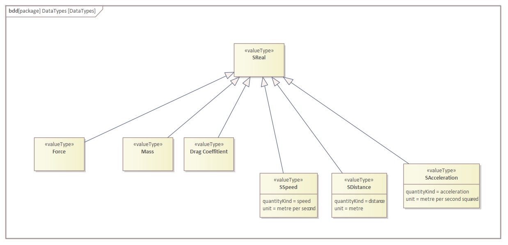

For the simulation context, there are specific datatypes that are also considered in the system's context (where relevant). The main type is the SReal which is the general type for every type used in the simulation context. All types are for describing the drone's physics properly and all of them are basic types used in physics. The names of the types describe their purpose in general. Drag coeffitient is used for describing constant values for air resistance.   

### Interfaces for simulation
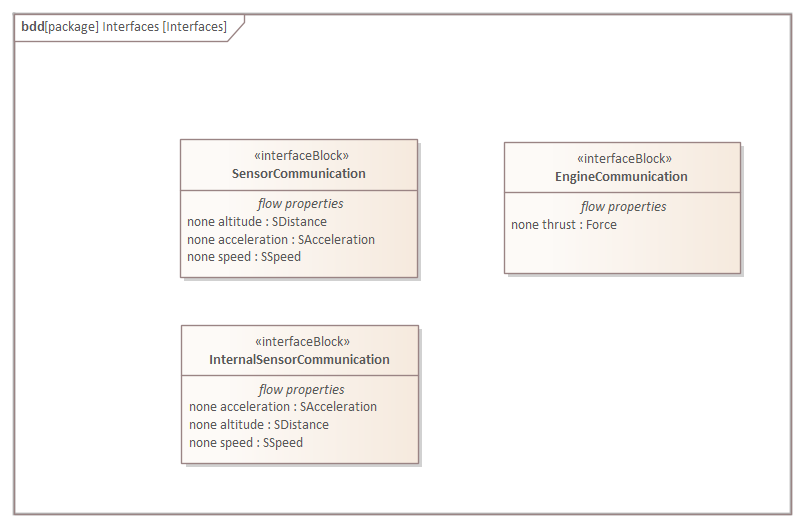

For the requirement's simulation context only sensors, the engine's controlling logic, and the drone's physics are necessary, therefore there are only these 3 interfaceblock needed for modeling the communication flows. The **SensorCommunication** interfaceblock is used for describing the flow of sensor data that are needed for carrying out the landing process (the current altitude, vertical acceleration and vertical speed of the drone). The **InternalSensorCommunication** is used for the same purpose but between internal components (note that this represents the interfaceblock that has the same name in the system, but describes it from a different perspective). The **EngineCommunication** is for describing the flow of thrust data used for controlling the engine properly (this is relevant predemonantly in the context of simulation, therefore it is not used in the system's high-level communication).    

### Simulation BDD
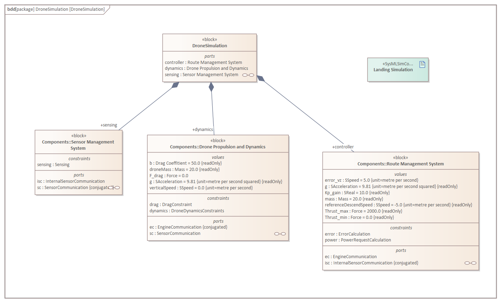

The **DroneSimulation** component aggregates the components needed for describing the simulation (this is the simulated model element). The elements are defined in the components package.

**Sensor Management System and Route Management System**: These components represent the sensors' management system and route management system from the simulation's perspective and logically have the same purpose as the ones with the same names in the system's logical description.

**Drone Propulsion and Dynamics**: This components describes the drone's physical behavior and components.

### Simulation IBD
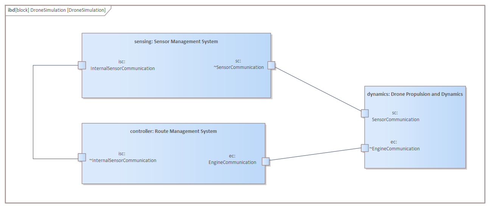

The Simulation context's IBD defines the communication flows between the components used in the context of simulation. The **Route Management System** calculates the thrust value used by the engine to control the drone's propellers during the landing process. It sends these values continuously to the engine via the **EngineCommunication** port. The engine is represented by **Drone Propulsion and Dynamics** here. 

The sensors provide continuous feedback via the outer SensorCommunication port. The physical sensors are also represented by **Drone Propulsion and Dynamics**. Sensor data are collected and preprocessed by the **Sensor Management System**. The sensor data are then forwarded to the **Route Management System** via the **InternalSensorCommunication** ports to continuously recalculate the thrust value.

### Drone Propulsion and Dynamics
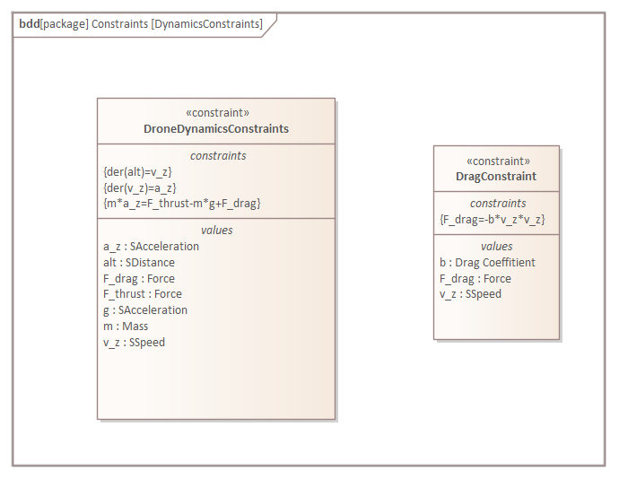

The drone's physical properties and constraints are described in the **DroneDynamicsConstraints** and **DragConstraint** constraint blocks. Here, Newton's laws are used:
* The derivate of the altitude is the vertical speed
* The derivate of the vertical speed is the vertical acceleration
 * Newton's **F = m * a** formula is also used. The drone is affected by the force of the engine (pushes it upwards), the gravitational force (pulls it downwards) and the dragging force of the air (pushes is upwards).

The dragging force is affected by the current speed of the drone. This is modeled using the square of the speed and a dragging constant.

The values were automatically generated by EA.

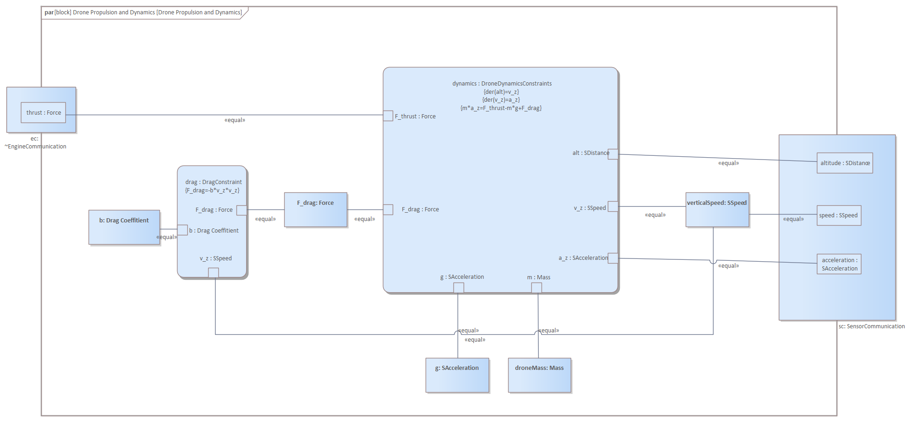

The diagram above describes the basic physical behavior of the drone. The thrust values are gathered from the **Route Management System**, g, the drones mass and the drag values are constants. The dragging force is defined by the drag constraint is equal to the one used to described in the drone's basic dynamics. The calculated current speed, altitude and acceleration values are equal to the ones provided by the sensors (and gathered by the **Sensor Management System**).

### Sensor Management
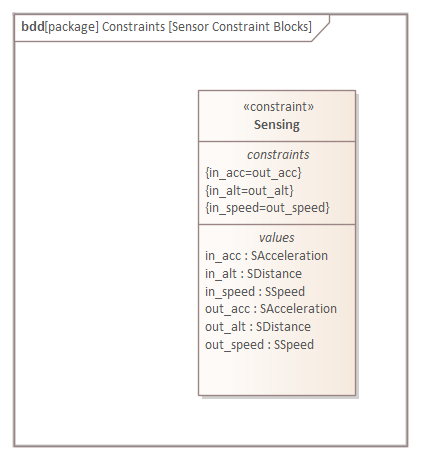

The sensor management logic only forwards data to the engine controlling logic, therefore the constraints are only equations between the input and output values (data preprocessing is omitted here as it is not needed for simulation).

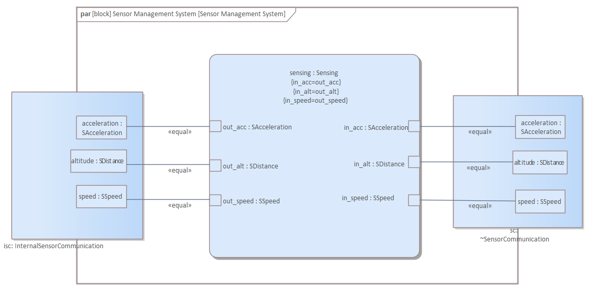

The parametric diagram of the **Sensor Management System** ensures these equations so that the simulation can work correctly.

### Engine controlling logic (route managent)
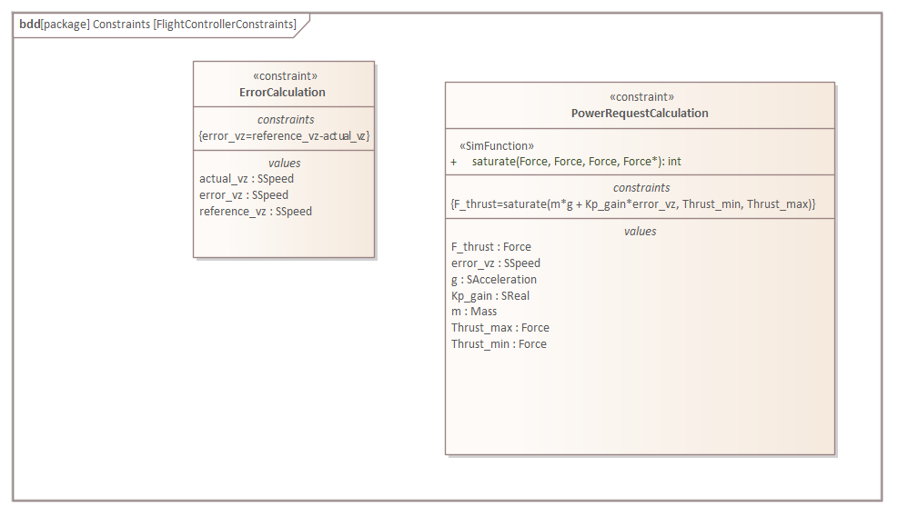

The **Route Management System** has the role of controlling the engine based on received data. The control unit has the aim of maintaining a desired (prespecified) landing speed. For this, the constraint is that a calculated error between the desired reference speed and the actual speed must be their difference that the controlling unit tries to lower to 0 (**ErrorCalculation**). 

Using the constant values describing the engine maximum and minimum (0) power, a constant gain, the drone mass, the calculated error and the constant value of g, the thrust used by the engine is calculated by the following function. The function satures the values defined by the constraint to keep the drone desceneding at the desired speed in a way not exceeding the maximum power of the engines. (Note that the thrust value calculated must be used by all 4 of the engines.)

```
F_thrust := if F_hover_thrust < Thrust_min then
	Thrust_min
	else if F_hover_thrust > Thrust_max then
	Thrust_max
	else 
	F_hover_thrust;
```

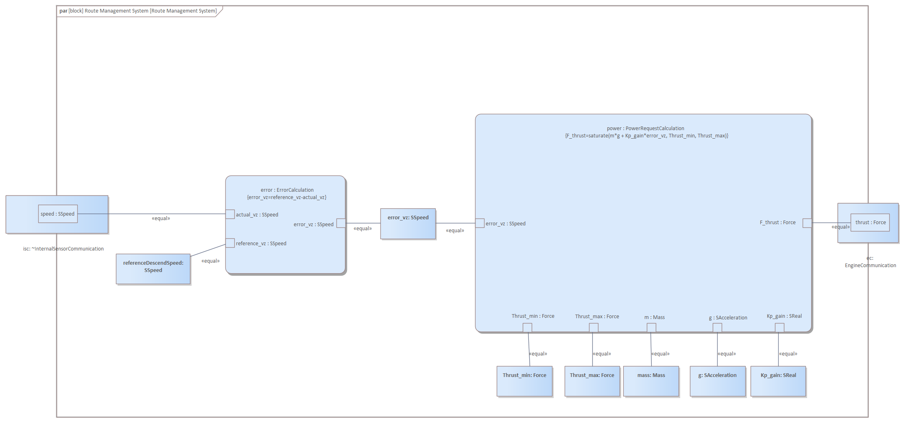

## Traceability

The following diagram shows for every use case, the corresponding requirements, and the components that trace the use case.
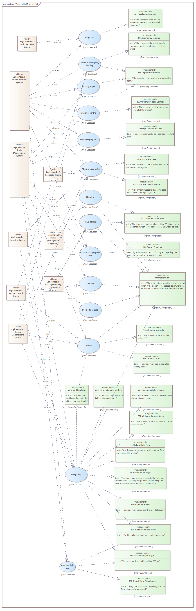

The following diagram shows for every component the corresponding requirements that they satisfy. 
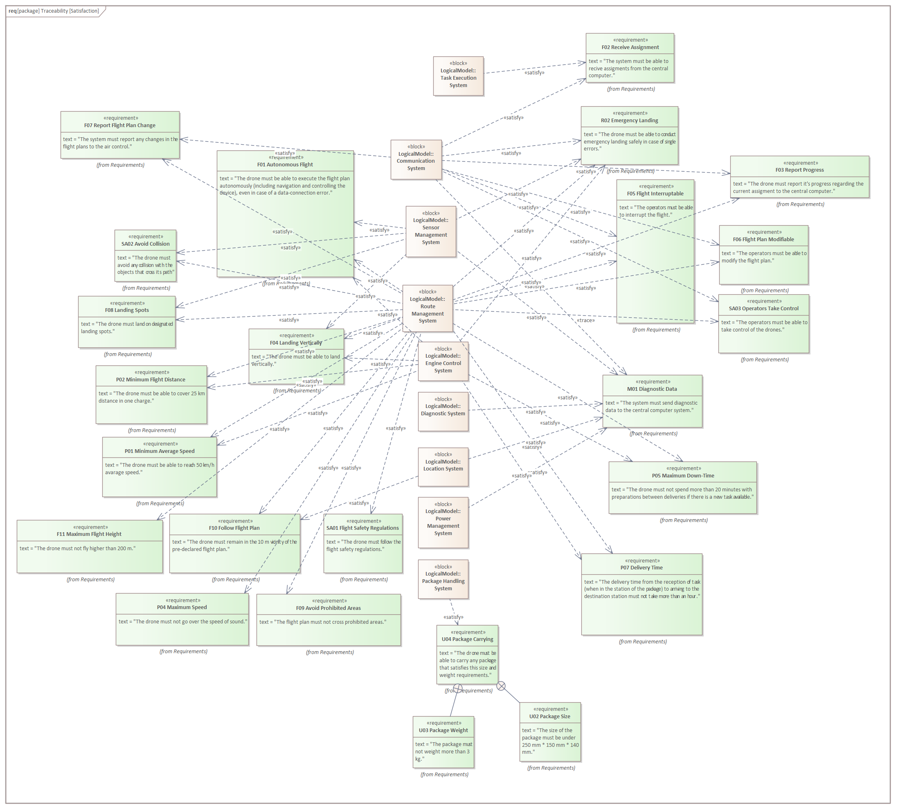

The following diagram shows which model elements verify the given requirements.
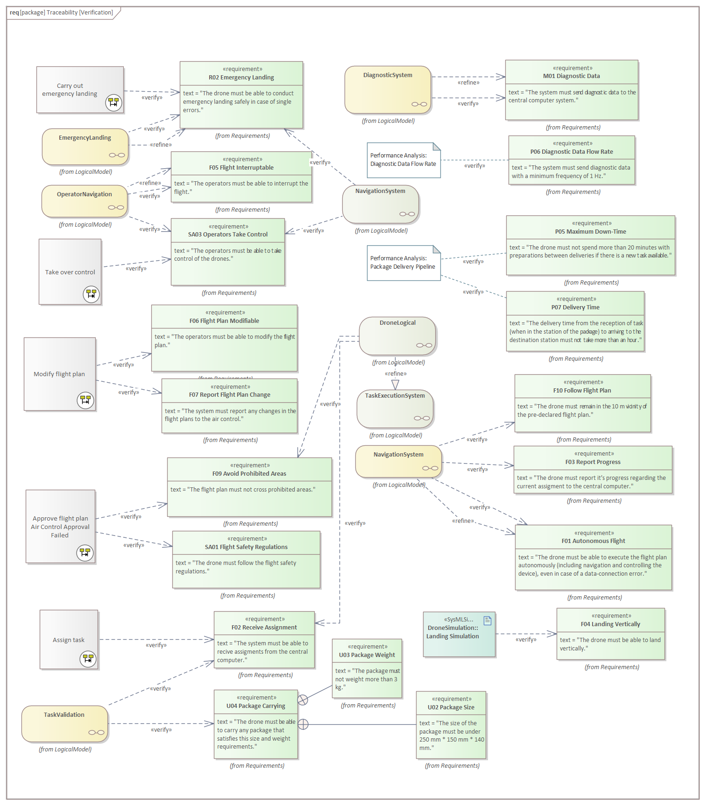

We used deriveReqt and Nesting connection to refine requirements.

## Fault-tolerance considerations

* Duplicate components for redundancy: 2 CPUs (hardware and software, hot), 3 Gyroscopes, a Primary and a Secondary Battery (cold). There are also 4 engines and propellers designed so that if one of them is disabled, the Drone is still able to fly. (Also if 2 diagonal are disabled.) Using a proper communication protocol with redundant messages: time and information redundancy
* Validation of the package data by the **Package Handling System**, task data by the **Task Execution System** and planned route via **Air Control** also make the Drone more fault tolerant.
* **Fault Tree**, **Failure Mode and Effects** and **Performance Analyses**.
* Availibility of frequent **diagnostic analysis** via continuous dataflow.
* Maintenance provided in **Landing Pads** by workers.
* 
* Choice of high-quality components for reliability and durability.
