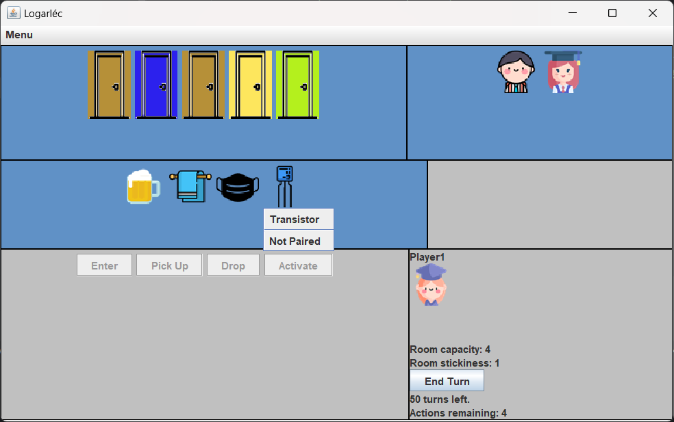
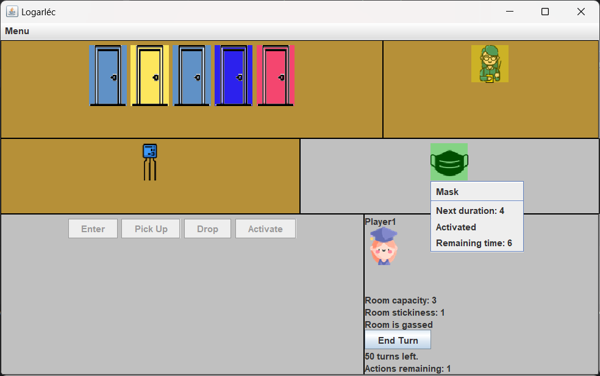

# Software Project Laboratory
## Software developement

- Language: Java
- Goal: Designing a game based on Specification. First making a skeleton of the model which is proven to work. Then implementing the Prototype of the game as a CLI application with a great set of test case. Finally providing a user interface for the full experience.

### Short description
The game is played in the labyrinth like K building of BME. Players are with students whose goal is to find the Slide rule. On their way through the rooms they might meet Teachers, who fire them from the university which means their game is over. On the other hand they can use several mystical items like wet rag, beer, camembert cheese and teleporting transistors to fight their way through the obstacles of teachers and erratic rooms.

Fully detailed documentation and design of the project in: $Documentation.pdf$

