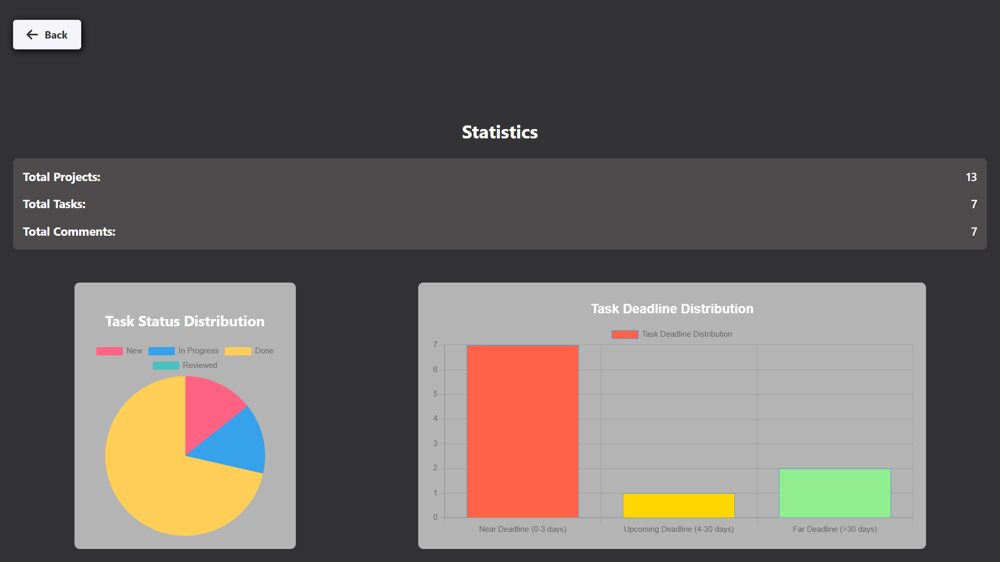

# Client-Side Systems

#### Topic Selection:  
**TaskMaster - Project and Task Management Web Application** 
#### Language:
**TypeScript with React**

#### Note: I also made my own MongoDB database and TypeScript server with client-server communication throught defined package format and port.

#### Features:  
- **Project Creation & Task Assignment:** Create projects, assign tasks, add status updates and deadlines, and store them persistently.  
- **User Profile & Settings:** Modify the application's appearance, manage user profiles.  
- **Statistical Visualization of Task Progress.**  
- **Comments & Feedback:** Add comments to each task.  
- **Reminders & Notifications:** Set up reminders and notifications for tasks.  
- **Task Sharing Option.**  
- **Animation & Sound Effects When Completing a Task.**  

#### Views:  
- **Main Application Screen** for navigation.  
- **Project List View.**  
- **Project View** with a task list.  
- **Task View.**  
- **Profile & Settings View.**  
- **Statistics Page.**  
- **Interface for Managing Comments.**

### Login screen

### Dashboard

### Settings

### List of projects

### Tasks of a project

### Creating new task

### Comments of a task

### Statistics of profile
